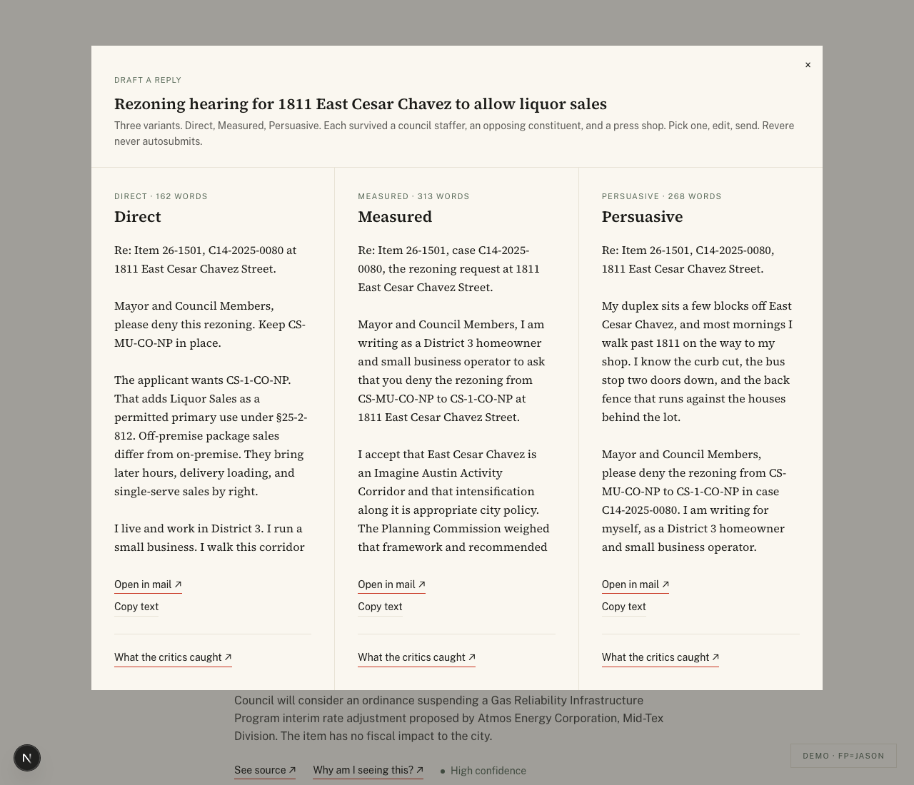
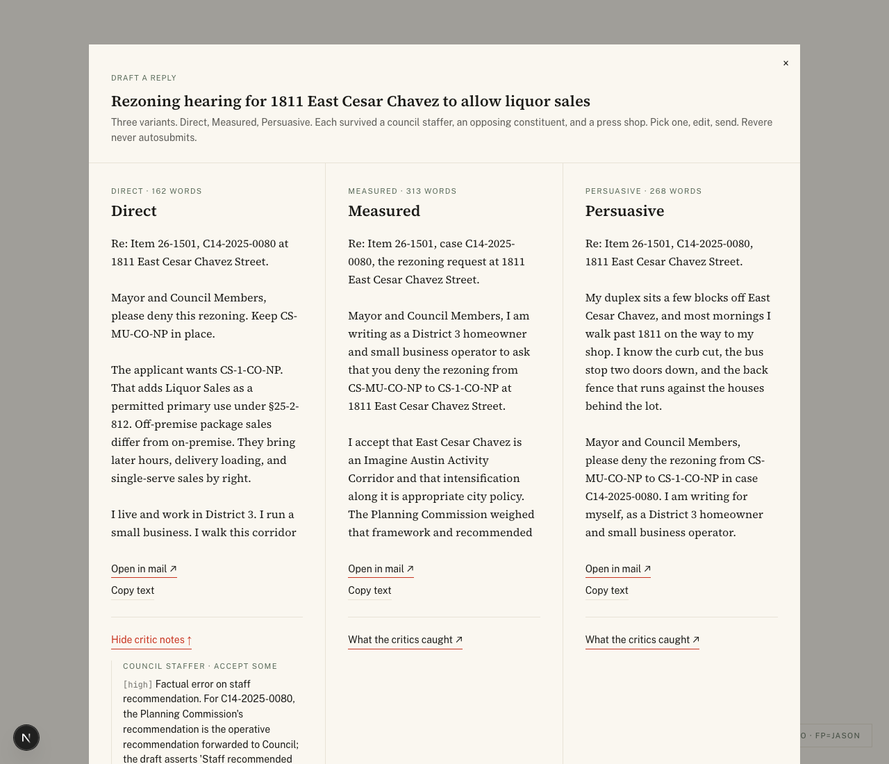
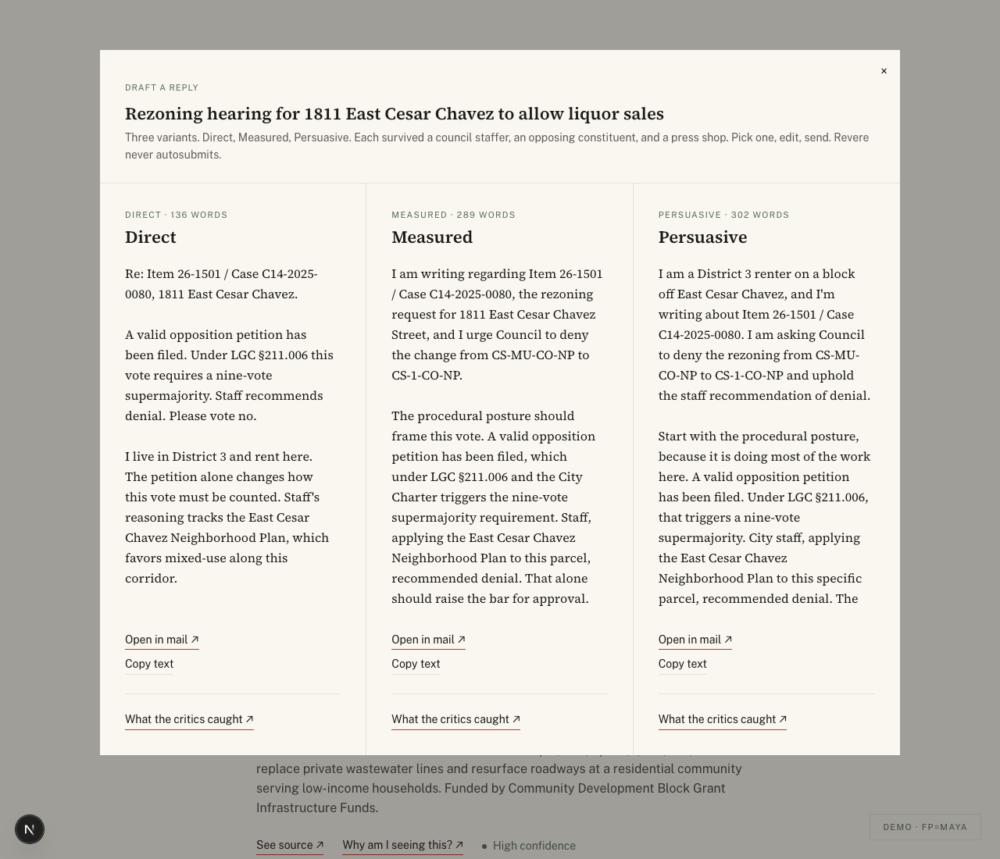
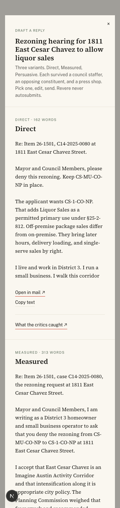

# T-22 — Draft variant UI

The action-flow modal. Three variants side-by-side at desktop, stacked
at mobile, with mailto + clipboard handoffs and a per-variant
"What the critics caught ↗" toggle. PRD §10 + Session 8 plan.

## What ships

- `apps/web/src/lib/queries/drafts.ts` — admin-client query returning
  3 rows in voice order (direct, measured, persuasive).
- `apps/web/src/components/briefing/DraftModal.tsx` — three-up modal
  layout. Per variant: voice tag + word count, voice headline,
  serif body in a vertical-scroll pane (max-height 28rem), mailto
  CTA, clipboard CTA, critique-trail toggle.
- `apps/web/src/components/briefing/BriefingItem.tsx` — adds the
  "Draft a reply ↗" button. Conditional on `hasDrafts` so non-seeded
  items don't show a dead button.
- `apps/web/src/components/briefing/BriefingView.tsx` — extends
  OpenModal discriminator to `'source'|'trace'|'draft'|null`. Single
  modal at a time.
- `apps/web/app/briefing/page.tsx` + `apps/web/app/demo/page.tsx` —
  pre-fetch drafts in the same `Promise.all` enrichment hop as zoning
  extractions and traces.

## Layout

- **Desktop ≥ 768px** (`md:grid-cols-3`): three columns of
  hairline-divided variants. Each column's body scrolls independently
  via `max-h-[28rem] overflow-y-auto`. Outer modal max-width 5xl
  (1024px) so each column gets ~340px of prose width.
- **Mobile < 768px**: stacked. Hairline dividers between variants.
  Each section header (e.g. `MEASURED · 313 WORDS`) is the visual
  anchor; the body flows in serif beneath.

## Submission channel

- mailto button: `mailto:council@austintexas.gov?subject=...&body=...`
  with subject "District {district} comment — Item {file_id}" and
  body = the variant text. Clicking opens the user's mail client; we
  never see the send.
- Clipboard button: copies the variant body only — for users pasting
  into Austin's public-comment form themselves. Brief "Copied to
  clipboard ✓" confirmation, no analytics.

## Gate evidence

### 1. Jason × 26-1501 — three-up at 1280px

Direct (162 words) · Measured (313 words) · Persuasive (268 words).
Three visibly different drafts: Direct opens with "Mayor and Council
Members, please deny this rezoning. Keep CS-MU-CO-NP in place.";
Measured opens with the homeowner-and-small-business framing;
Persuasive opens with the duplex-and-walking vignette.

### 2. Jason × 26-1501 — Direct critic notes expanded

`What the critics caught ↗` toggled on the Direct column. The
critique_trail renders as a bordered list per critic
(council_staffer, opposing_constituent, press_shop), each with
`[severity]` tags + the refiner's one-line response in mono.

### 3. Maya × 26-1501 — same item, different drafts

Same layout, but every variant frames the case differently from
Jason's. Maya's Direct opens with the procedural petition + LGC
§211.006 supermajority framing; Measured leads with "I am writing
regarding Item 26-1501... and I urge Council to deny the change."
Persuasive frames the housing-piece argument from a renter's
perspective.

### 4. Jason × 26-1501 — mobile 380px stacked

Layout collapses to a single column. Voice section headers act as
sticky-feeling anchors. Each variant's CTAs and critique toggle
remain accessible. The serif body flows naturally on a phone.

## Architecture notes

- **Server-side pre-fetch**: drafts are loaded in the same
  `Promise.all` over typed rows as extractions + traces. Each item
  costs one extra query. Currently only 26-1501 has drafts seeded
  (4 + 6 = 6 rows total, 3 per persona); the `hasDrafts` flag
  conditionally renders the button.
- **mailto encoding**: `URLSearchParams` handles encoding correctly
  for both the subject and body. Body length is bounded by the
  drafting skill's 360-word cap (~2200 chars), well under the
  ~2048 char practical mailto limit on most mail clients.
- **Single-modal discriminator**: BriefingView still has only one
  `openModal` state. Clicking "Draft a reply" while source-proof or
  trace is open closes the prior cleanly because the conditional
  rendering re-evaluates on every state change.
- **Vermilion ceiling holds**: button underlines (See source ↗ /
  Why am I seeing this? ↗ / Draft a reply ↗) and the per-variant
  critique toggle are the only vermilion uses in the modal. Voice
  tags + critic labels stay district sage.
- **Body scroll within columns**: `max-h-[28rem]` keeps the modal
  height bounded at 1280×900. Long Persuasive variants scroll
  inside their column; the outer modal doesn't grow.

## Cost ceiling

Phase B added zero model calls. Total Session 8 (T-21 + T-22) ≈
**$1.10** in Opus 4.7 vision/draft calls, well under the $3 plan
ceiling.
