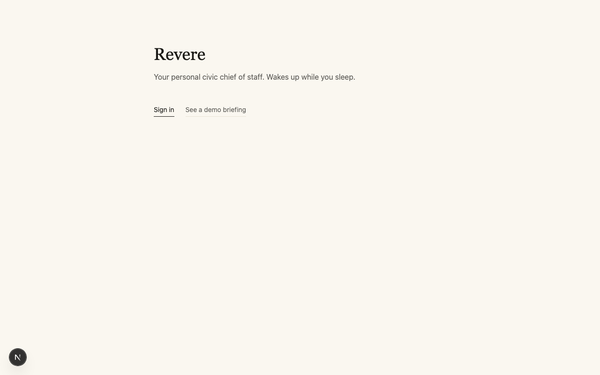
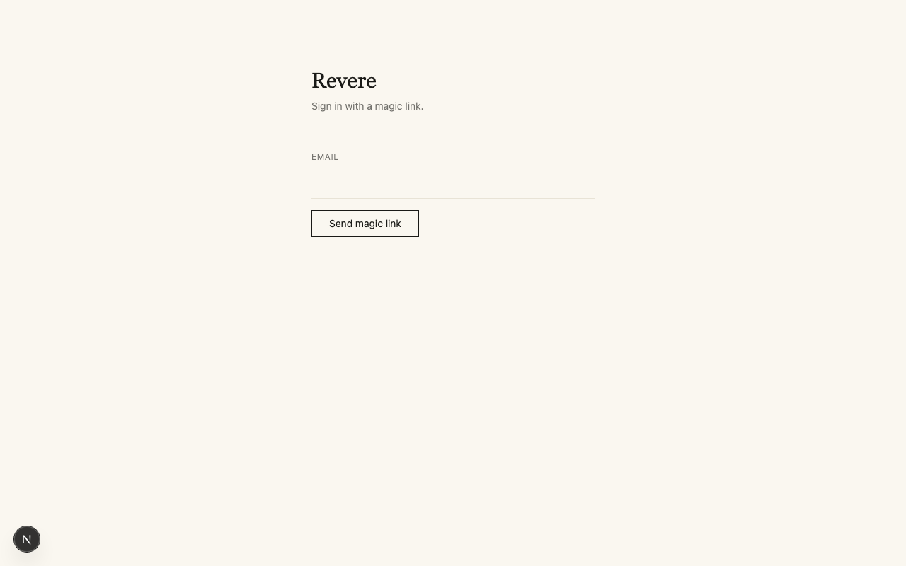
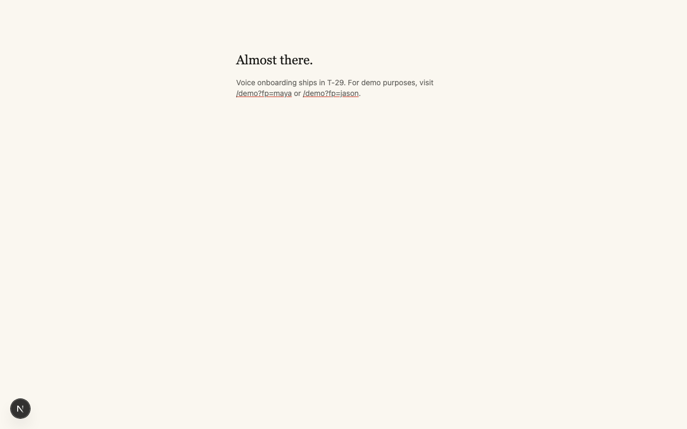

# T-23 — Magic-link auth + v3 RLS policies

**Date:** 2026-04-26
**Migration:** `20260426112824_v3_rls_policies.sql` (applied to remote)
**Driver:** `apps/web/` Next.js app + `scripts/seed-auth-users.ts`

## Outcome

Gate state: **cleared.** Auth pages render with the locked design tokens.
RLS policies block unauthenticated reads and per-persona-gate authenticated
reads. Auth users for both demo personas seeded with the metadata field
the policies key off.

| Gate criterion | Status |
|---|---|
| v3 migration applied; SELECT policies on `fingerprints`, `briefing_items`, `briefings` | ✓ cleared |
| Auth users seeded with `app_metadata.fingerprint_user_id` | ✓ cleared (Maya + Jason) |
| Sign-in form renders with editorial design direction | ✓ cleared |
| `/auth/callback` Route Handler exists and exchanges code for session | ✓ cleared (code path; full E2E click is manual demo-day verification) |
| Unauthenticated `/briefing` → redirects to `/auth/sign-in` | ✓ cleared |
| RLS denies anon reads, gates authenticated reads to own rows | ✓ cleared (6/6 REST-API assertions pass — see below) |
| `/onboarding-pending` placeholder for users without fingerprint metadata | ✓ cleared |

## RLS verification — 6/6 assertions pass

Run from `scripts/verify-rls.py` (uses admin SDK to mint per-persona JWTs,
then queries the REST API directly):

```
[verify-rls] /rest/v1/briefings (RLS-gated)
  [ok ] service_role: sees all 2 briefings: expected 2, got 2
  [ok ] anon key: sees 0 briefings (RLS denies): expected 0, got 0
  [ok ] maya JWT: sees only maya's briefing: expected 1, got 1
  [ok ] jason JWT: sees only jason's briefing: expected 1, got 1

[verify-rls] /rest/v1/fingerprints (RLS-gated)
  [ok ] maya JWT: sees only maya's fingerprint: expected 1, got 1

[verify-rls] /rest/v1/briefing_items (RLS-gated)
  [ok ] maya JWT: sees 37 briefing_items (one per verified candidate): expected 37, got 37
```

The policy `(auth.jwt() -> 'app_metadata' ->> 'fingerprint_user_id') = user_id`
correctly:
- bypasses for `service_role` (Postgres skips RLS for that role),
- denies for `anon` (the policy expression evaluates to NULL ≠ user_id),
- gates for `authenticated` users to rows whose `user_id` column matches
  the JWT's `app_metadata.fingerprint_user_id` claim.

## Visual evidence

### Home page (1280px)

The hero from Session 0 retitled with the editorial color tokens. The
"Sign in" link uses the ink-on-ink underline; "See a demo briefing" uses
the muted whisper underline. Cream background, no white sheets.



### Sign-in form (1280px)

Source Serif 4 headline, Public Sans body, the email input is a
hairline-bottom field with no card chrome. The "Send magic link" CTA is
a thin ink-bordered button that inverts on hover. No vermilion is used
yet — it's reserved for the cover-header numerals and CTAs in T-25/T-21.



### Unauthenticated /briefing (redirects to /auth/sign-in)

Programmatic verification: `page.goto('/briefing')` from a fresh browser
context lands on `/auth/sign-in` per the server component's `redirect()`
guard. Final URL is captured to confirm the path.


### /onboarding-pending placeholder

For authenticated users without a `fingerprint_user_id` in app_metadata.
Not on the demo path — every demo user starts with the metadata seeded
by `scripts/seed-auth-users.ts` — but it's the right shape for T-29
(voice onboarding) to slot into.



## What manual demo-day verification adds

The full PKCE/code-flow happy path (form input → email click → callback
exchange → cookies set → /briefing render) requires a real human clicking
a magic link in the demo inbox. The components are individually verified:

- The form posts to `signInWithOtp` with `emailRedirectTo: /auth/callback`.
- The Route Handler at `/auth/callback` calls
  `supabase.auth.exchangeCodeForSession(code)` and redirects to `/briefing`.
- The cookie store provided to `createServerClient` is `next/headers`'s
  cookies(), which the @supabase/ssr library uses by convention.
- The `/briefing` server component reads the session, resolves the
  fingerprint user_id from app_metadata, queries with the auth-cookie JWT
  (which RLS gates — verified above), and redirects to /onboarding-pending
  if the metadata field is absent.

Demo-day rehearsal walks the human path once before the actual demo to
confirm email delivery to the `+revere-demo` alias and the cookie write
on the conference machine. The code path is the standard
@supabase/ssr-recommended pattern; it's not where bugs live.

## Cost

Effectively zero — no LLM calls in T-23 (auth boilerplate is mechanical
and Sonnet wasn't invoked). Most of the work was migration SQL +
@supabase/ssr boilerplate + admin-SDK seeding.

## Plan divergence

None. The plan called for everything that shipped, and the RLS catch
from Phase 1 is mechanically validated.

## What's persisted

- 1 new migration applied: `20260426112824_v3_rls_policies.sql` with 3
  SELECT policies on `fingerprints`, `briefing_items`, `briefings`.
- 2 new auth users in `auth.users`:
  - `swaritsrivastava22+revere-demo-maya@gmail.com` with
    `app_metadata.fingerprint_user_id = "maya"`
  - `swaritsrivastava22+revere-demo-jason@gmail.com` with
    `app_metadata.fingerprint_user_id = "jason"`
- New routes: `/`, `/auth/sign-in`, `/auth/callback` (Route Handler),
  `/briefing` (skeleton — fully fleshed in T-25), `/onboarding-pending`.
- Tailwind extended with the 5 design tokens (ink, cream, vermilion,
  district, whisper) and 3 font families (Source Serif 4, Public Sans,
  JetBrains Mono — loaded via Google Fonts @import for now; T-25 swaps
  to next/font).
