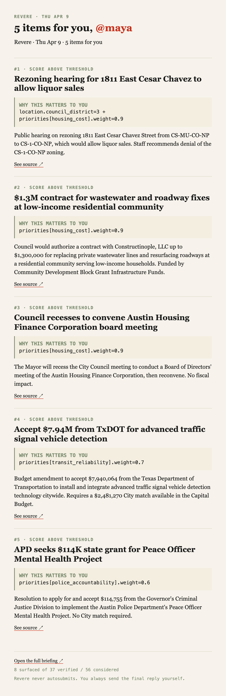
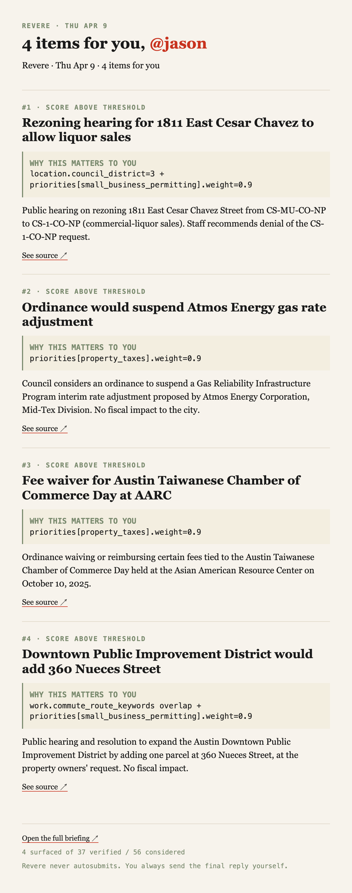

# T-24 — Morning briefing email

`pnpm email --user <fp>` renders a briefing payload as HTML + plain
text and sends via Resend. The renderer is pure; the CLI handles
load → render → send. Static evidence captures live in
`docs/verification/email-renders/` because this hackathon
environment doesn't carry a `RESEND_API_KEY` — the integration is
wired and `--dry-run` confirms the rendered output, but the actual
send waits on a one-line key + verified-sender setup.

## What ships

- `apps/orchestrator/src/email/render.ts` — pure-function
  `renderBriefingEmail({ payload, briefingDate, userId, appUrl })`
  → `{ subject, text, html }`. Mirrors the in-app editorial
  direction (newspaper serif, district-sage labels, vermilion
  underlines, why_this in mono).
- `apps/orchestrator/src/email/email.ts` — CLI:
  `pnpm email --user <fp> [--briefing-date YYYY-MM-DD] [--to addr] [--dry-run]`.
  Opens an `agent_sessions` row of runtime=`emailer`, loads the
  briefing, renders, sends via Resend, closes the row.
- `apps/orchestrator/src/email/render-static.ts` — diagnostic
  helper used by Gate 3 to dump rendered HTML/text to disk for
  visual review.
- `resend@4` added to orchestrator deps.

## Subject + structure

```
Subject: Revere · {dow} {Mon} {d} · {N} item{s} for you
```

Body (in order):
1. Header strap: "Revere · Thu Apr 9"
2. Headline: "5 items for you, @maya" (vermilion @persona)
3. Cover-header strap from the briefing payload
4. Per-item article: rank + surface_reason → headline → why_this
   block (district-sage label, mono body) → what_happened (clipped
   to 320 chars) → "See source ↗" link
5. Footer: "Open the full briefing ↗" + coverage strap +
   "Revere never autosubmits" disclaimer

## Gate evidence

### 1. Maya — 5 items

`docs/verification/email-renders/maya.html` (8.8 KB) +
`maya.txt` (2.3 KB).



Subject: `Revere · Thu Apr 9 · 5 items for you`. Top item is the
rezoning at 1811 East Cesar Chavez. why_this rendered verbatim
("location.council_district=3 + priorities[housing_cost].weight=0.9").
Items 2-5 cover wastewater contract, Housing Finance Corp board,
TxDOT traffic signals, APD mental-health grant — distinct
priorities (housing, housing, transit, police accountability).

### 2. Jason — 4 items

`docs/verification/email-renders/jason.html` (7.3 KB) +
`jason.txt` (1.8 KB).



Subject: `Revere · Thu Apr 9 · 4 items for you`. Top item again
is the rezoning, but Jason's why_this is
`priorities[small_business_permitting].weight=0.9`. Items 2-4
cover Atmos Energy gas rate, Taiwanese Chamber fee waiver,
Downtown Public Improvement District — distinct from Maya's set
even though the underlying meeting is identical.

### 3. Dry-run smoke (renderer ↔ Supabase)

```
$ pnpm email --user maya --dry-run
[T-24] rendered subject="Revere · Thu Apr 9 · 5 items for you"
[T-24] text length=2335 html length=8831
[T-24] dry-run: skipping send
[full text body printed]
```

Closing prose verbatim:
```
8 surfaced of 37 verified / 56 considered

Open the full briefing: http://localhost:3000/demo?fp=maya
Revere never autosubmits. You always send the final reply yourself.
```

## To go from dry-run to real send

1. Sign up at <https://resend.com> (free tier, 100 emails/day from
   `onboarding@resend.dev`).
2. Add to `.env.local`:
   ```
   RESEND_API_KEY=re_...
   EMAIL_FROM=Revere <onboarding@resend.dev>
   APP_URL=https://...   # whichever Vercel URL the briefing is at
   ```
3. `pnpm email --user maya` (or `--user jason`).

## Architecture notes

- **Pure render**: `renderBriefingEmail` is a pure function. No
  Anthropic calls, no Supabase. Cheap to call repeatedly during
  iteration; the whole thing is ~150 lines.
- **HTML inlines all styles**: gmail/outlook strip `<style>` tags
  in the head; every CSS rule is `style="..."` on the element. The
  preview clients render as designed.
- **Body cap**: each item's `what_happened` is clipped to 320 chars
  with an ellipsis. The HTML and text both clip; the text version
  also includes the "See source" deep-link to /demo?fp=...
- **No Anthropic in this path**: the email is a reformat of the
  composed `briefings.payload`. Cost: $0.

## Risks observed

- **Domain-verified sender required for production**: Resend's
  free-tier `onboarding@resend.dev` works for personal/test
  inboxes; production needs a verified sender domain. Out of scope
  for the hackathon.
- **mailto-vs-email**: the in-app DraftModal already uses `mailto:`
  for action-flow handoff. The morning email is a separate channel
  (read, not reply). Both coexist.
