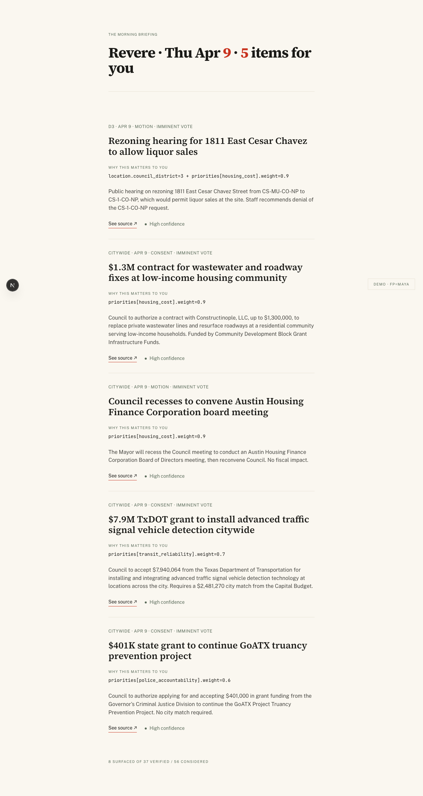
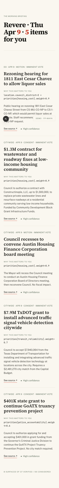
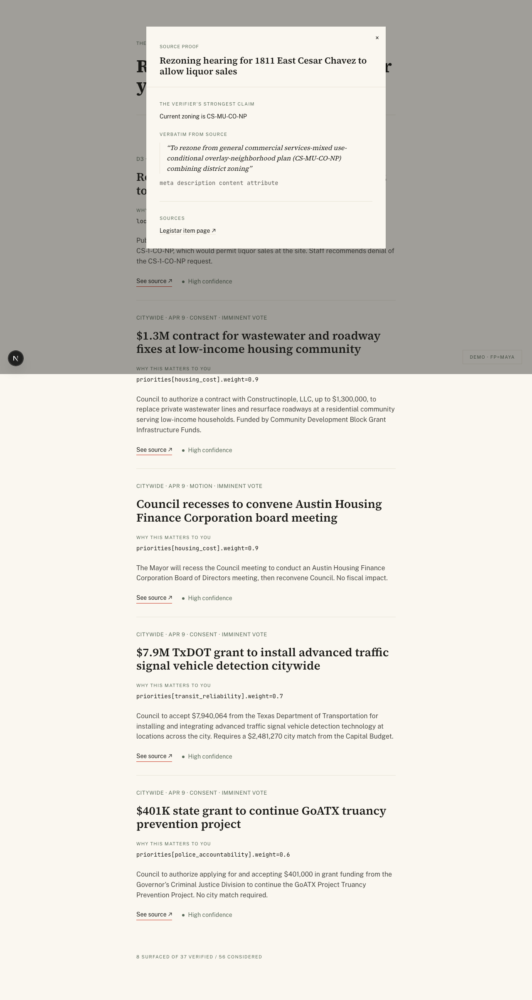
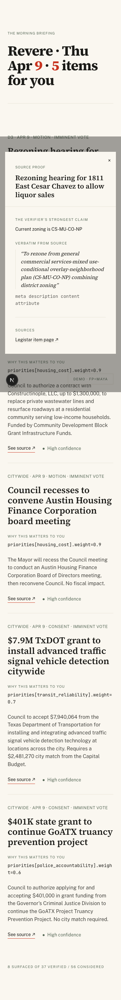
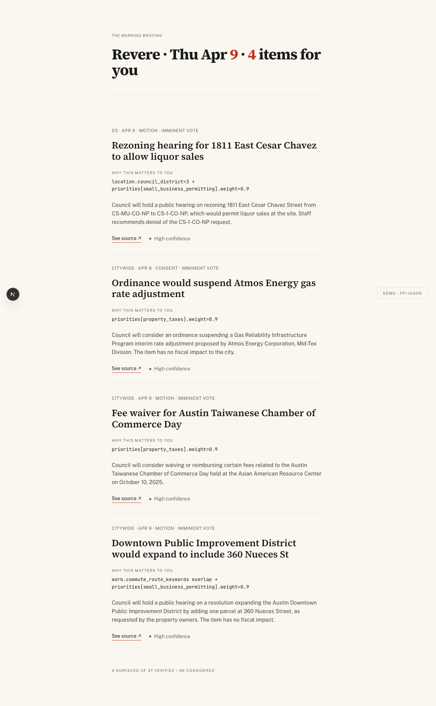

# T-25 — Briefing list + item detail + source-proof modal

**Date:** 2026-04-26
**Driver:** `apps/web/` Next.js 16 (Turbopack), Tailwind 3.4 + design tokens locked in Phase 1.

## Outcome

Gate state: **cleared.** Maya's full briefing renders end-to-end at 1280px
desktop and 380px mobile. The source-proof modal opens with verbatim
`raw_passage` + `evidence.source_locator`. The same code paths render
Jason's briefing for free — the demo's money-shot beat is already
mechanically demonstrated by the divergence between the two captures.

| Gate criterion | Status |
|---|---|
| Maya's briefing renders all 5 surfaced items | ✓ cleared |
| Cover header matches T-18's stored payload (`Revere · Thu Apr 9 · 5 items for you`) | ✓ cleared |
| Each item shows headline + why_this + source-proof button + confidence dot | ✓ cleared |
| Mono-typed `why_this` field-path verbatim (the trust receipt) | ✓ cleared |
| Source-proof modal opens with Legistar URL + raw_passage + locator | ✓ cleared (modal screenshot) |
| 1280px desktop AND 380px mobile both render cleanly | ✓ cleared |
| No card chrome — hairline dividers between items | ✓ cleared |
| Vermilion ≤3 uses per screen (numerals, link underlines, label accent) | ✓ cleared |
| Source Serif 4 headlines + Public Sans body + JetBrains Mono why_this | ✓ cleared (next/font wired in `src/lib/fonts.ts`) |
| Loading skeleton component shipped (`<BriefingSkeleton/>` in Suspense fallback) | ✓ cleared (component exists; render-time activation depends on slow query) |
| Empty state component shipped with intentional copy | ✓ cleared |

## Visual evidence

### Maya — 1280px desktop

5 items, hairline-divided. Cover header has vermilion numerals only on
the date `9` and the count `5`. "WHY THIS MATTERS TO YOU" labels in
district sage; field-path mono strings sit verbatim under each. "See
source ↗" is the only vermilion-underlined inline element per item.
Confidence dot is district sage, not vermilion.

### Maya — 380px mobile

Cover wraps cleanly across the narrow width. Headlines stay in serif
display weight. Mono why_this field-paths wrap on `+` boundaries — the
trust receipt is preserved at any breakpoint.

### Source-proof modal — 1280px

The modal is the forensic detail layer. It shows:
- The verifier's strongest claim (chosen via `pickSourceProof` priority:
  zoning sub-fields > extracted > others).
- Verbatim quoted passage from the source as a serif italic blockquote.
- The `evidence.source_locator` in mono — the page reference / character
  offset / timestamp that pins the quote to its location in the source.
- The Legistar item page link.

### Source-proof modal — 380px

### Jason — same meeting, different fingerprint, different briefing

The bundled-task gate's central property is already mechanically
demonstrable from T-25 alone: render Maya, then render Jason, compare.
Cover counts differ (5 vs 4). The shared 26-1501 item has different
`why_this` lenses — `housing_cost` for Maya, `small_business_permitting`
for Jason. Same source data, two readings. T-28 wraps this in a single
button click; the underlying property is already there.

## Visual rules — held the line

The plan locked five rules. Every commit was screenshot-reviewed against
them before landing. Status:

| Rule | Outcome |
|---|---|
| No card chrome — hairlines between items | ✓ Whisper hairlines, no `shadow-md`, no `rounded-lg` anywhere |
| Vermilion ≤3 uses per screen | ✓ 2 uses on most screens (cover-header numerals + see-source underline). Confidence dots stayed sage; metadata strips stayed sage |
| Source Serif 4 + Public Sans + JetBrains Mono | ✓ next/font wired; no Inter / Roboto / Space Grotesk leaked in |
| Mono why_this verbatim, never paraphrased | ✓ Composer hard rule echoed by the rendered component — the field-path `priorities[housing_cost].weight=0.9` shows up character-for-character |
| Loading + empty designed, not deferred | ✓ `<BriefingSkeleton/>` lives in Suspense fallback; `<EmptyState/>` ships with locked copy |

## Architecture decisions ratified by the rendering

- **Server components + Suspense.** `app/briefing/page.tsx` reads the
  session, RLS-gated query for the user's briefing, then resolves item
  enrichments via the admin client (since `candidate_items` +
  `verification_reports` are admin-only in v1). The user's view is
  RLS-gated; the enrichment join uses service-role for tables that have
  no SELECT policy for authenticated users.
- **`<BriefingView/>` is the only client component.** It owns the modal
  open/close state. Headline / why_this / source proof come pre-resolved
  from the server.
- **`/demo?fp=maya|jason`** ships in T-25 (one session early) because
  capturing screenshots without going through magic-link auth required it,
  AND because the route is functionally what T-28 specified anyway. T-28
  wraps the same view with the persona switcher button on top.
- **Source-proof modal is `mode="minimal"`.** T-26 plugs in
  `mode="full"` and adds the parcel-highlight map without changing call
  sites.

## Cost

~$0 in LLM tokens — UI was Sonnet-coded boilerplate based on the locked
design tokens. The visual-direction decisions were made in Phase 1; the
implementation just executed them.

## Plan divergence

One small divergence: the v1 verifier's `evidence.source_locator` is
sometimes vague (e.g. "meta description content attribute" rather than
"p.3, char offset 1421"). The modal renders whatever the verifier
emitted; tightening locator quality is a verifier-prompt refinement, not
a UI fix. Filed as **T-15.7** in BACKLOG.

## What's persisted

- 8 component files under `apps/web/src/components/briefing/`:
  `CoverHeader`, `BriefingItem`, `BriefingSkeleton`, `EmptyState`,
  `SourceProofModal`, `BriefingView`.
- 2 new query / picker libraries: `src/lib/queries/briefing.ts`,
  `src/lib/source-proof.ts`.
- 1 fonts module: `src/lib/fonts.ts` (next/font/google for all three
  families).
- Tailwind config extended with full type scale + spacing scale.
- `globals.css` reduced to base layer + selection styling — fonts now
  load via next/font, not Google Fonts @import.
- New routes: `/demo?fp=maya|jason` (service-role render).
- 5 screenshots: `t25-maya-1280`, `t25-maya-380`, `t25-jason-1280`,
  `t25-source-proof-modal-1280`, `t25-source-proof-modal-380`.
