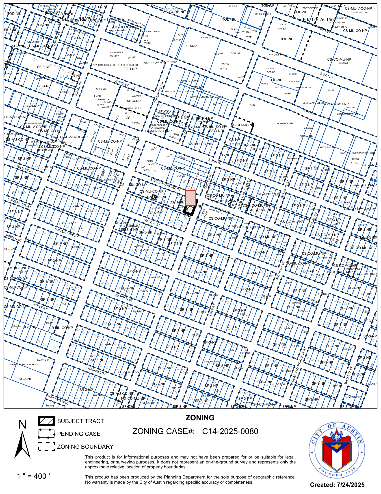
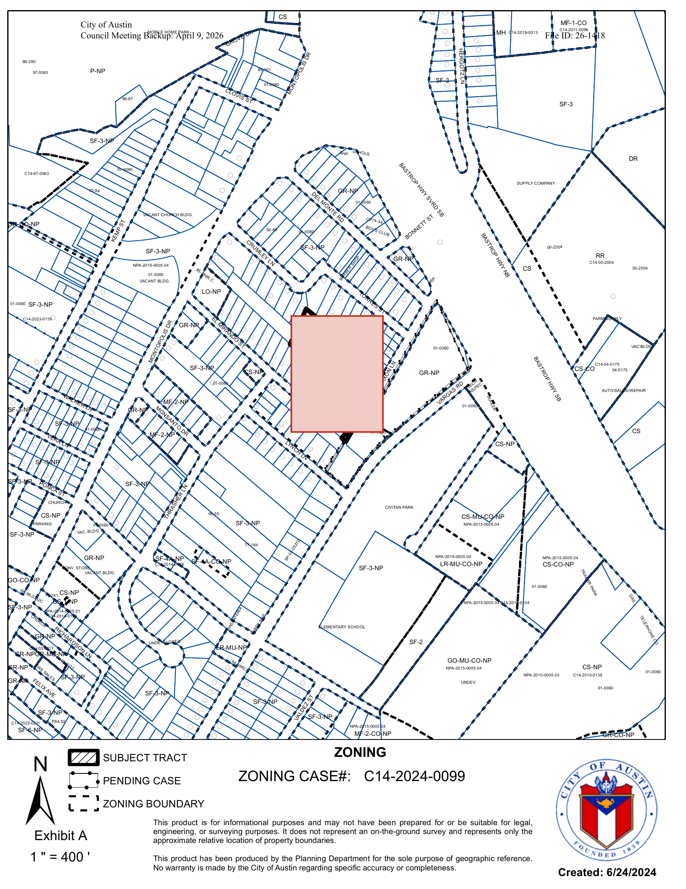
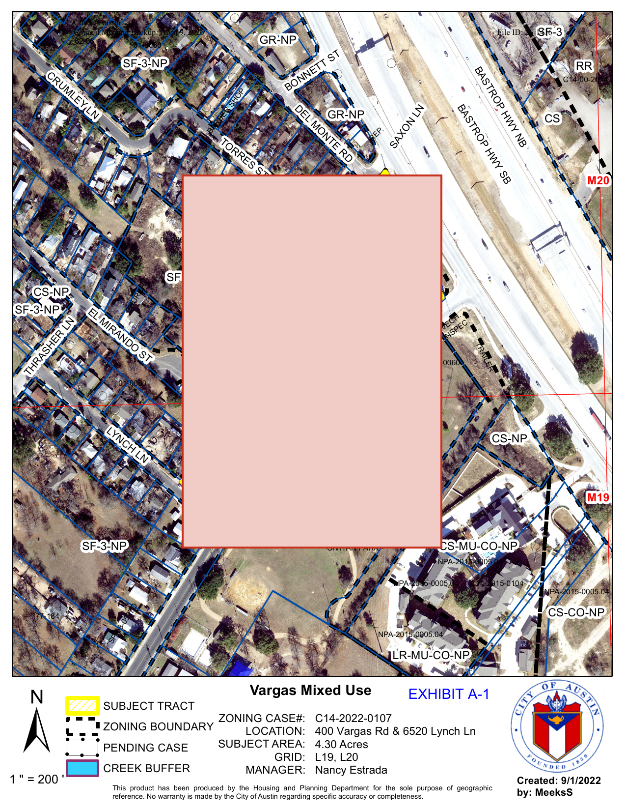
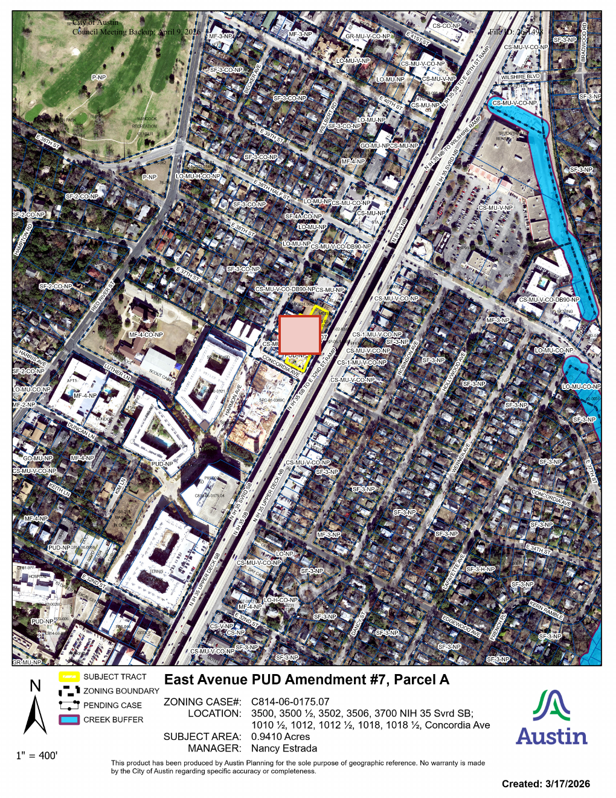

# T-26 Phase A — vision pipeline smoke + sweep

Two-stage Opus 4.7 vision pipeline (page-detect → parcel-localize) over the
2026-04-09 Austin City Council meeting. Smoke gate is **PASS**. Sweep
distribution is **11/11 high confidence**.

Persistence layer: `zoning_map_extractions` (v4 migration) +
`zoning-maps` Supabase Storage bucket (service-role-only, signed URLs
minted by the modal route).

## Smoke gate — 26-1501

**Item**: C14-2025-0080 — 1811 East Cesar Chavez Street rezone (CS-MU-CO-NP →
CS-1-CO-NP, opposed by petition).

**Stage 1 (page detect on 60 DPI thumbnails)**: page 8 of 23, confidence
high. Raw passage: identifies the page header reading
`ZONING / ZONING CASE# C14-2025-0080`.

**Stage 2 (parcel localize on 200 DPI render of page 8)**: bbox =
`{x: 825, y: 845, w: 50, h: 70}` on a `1700×2200` image, confidence high.
Raw passage notes the highlighted darker tract centered above the
`ZONING CASE#` legend.

**Eyeball check**: vermilion overlay lands precisely on the SUBJECT TRACT
(the small parcel highlighted darker on the city's zoning exhibit, three
blocks east of I-35 on East Cesar Chavez). See
`t-26-smoke-26-1501.png`.

## Sweep — 11 zoning candidates with both `zoning` sub-object + `staff_report` source

| candidate_item_id | item     | pdf MB | pages | page chosen | bbox             | conf |
|---|---|---|---|---|---|---|
| 51 | 26-1412 |  8.75 | 38 | 25 | 800,900,130,70  | high |
| 52 | 26-1413 |  5.58 | 17 |  8 | 770,850,240,110 | high |
| 53 | 26-1414 |  5.78 | 18 |  8 | 780,855,110,90  | high |
| 54 | 26-1415 |  7.30 | 48 | 33 | 740,720,270,330 | high |
| 55 | 26-1416 | 43.70 | 57 | 13 | 370,355,530,760 | high |
| 56 | 26-1417 |  5.83 | 34 | 25 | 783,866,175,240 | high |
| 57 | 26-1418 |  6.16 | 41 |  9 | 720,780,230,290 | high |
| 58 | 26-1467 |  9.44 | 64 | 13 | 480,540, 50, 40 | high |
| 59 | 26-1497 |  2.46 | 17 | 11 | 685,810,360,160 | high |
| 60 | 26-1498 | 19.82 | 99 | 11 | 461,521, 70, 65 | high |
| 61 | 26-1501 | 11.84 | 23 |  8 | 825,845, 50, 70 | high |

Distribution: **11 high · 0 medium · 0 low**. No fallback path exercised
in the sweep — but the modal still implements the no-overlay-+-deep-link
state for safety.

## Spot-checks (3 randomly sampled)

| item | overlay file |
|---|---|
| 26-1418 (C14-2024-0099, suburban tract) | `t-26-smoke-26-1418.png` |
| 26-1416 (Vargas Mixed Use, 4.30 ac aerial — bbox is generously sized but on-target) | `t-26-smoke-26-1416.png` |
| 26-1498 (East Avenue PUD #7, Parcel A on N IH-35 SB) | `t-26-smoke-26-1498.png` |

26-1416's bbox covers more than just the parcel polygon — the underlying
aerial doesn't have a clean polygon boundary, so the model bounds the
yellow SUBJECT TRACT generously. The center is correct; the modal renders
this with no caveat. Acceptable for v1; T-26.5 (re-extract at higher DPI)
is the BACKLOG follow-up.

## Cost

- Smoke (26-1501 dry-run + persisted): 2 Opus calls, ~37K input tokens.
- Sweep + retries: 14 + 2×4 = 20 Opus calls, ~237K input + ~3.5K output
  tokens.
- Approx total: **~$1.40** (well under the $1.30 plan estimate after
  retries; under the $5 ceiling).

## Architectural notes captured during smoke

- **5 MB API image limit**: Anthropic refuses base64-encoded images over
  5 MB. Base64 inflates ~33%, so raw PNGs over ~3.7 MB fail. Tabloid-size
  Staff Reports at 200 DPI come back at 6–10 MB. Fix:
  `rasterizeOnePageUnderByteCap` steps DPI down a ladder
  (200 → 150 → 120 → 100) until the PNG fits the cap. Persisted image
  resolution is therefore not uniform — modal renders the bbox in the
  pixel coords of the persisted image, so this is correct by construction.
- **Stage 1 token economy**: 60 DPI thumbnails per page average ~150 KB.
  At 50-page cap, a single stage-1 call is ~7–8 MB of payload, fits
  comfortably under the 32 MB request limit.
- **Storage bucket Gateway Timeout** observed once on 26-1412 during the
  initial sweep; clean retry. No retry shim added in v1 — re-runs are
  idempotent (upsert on `(candidate_item_id, extractor_version)`).
