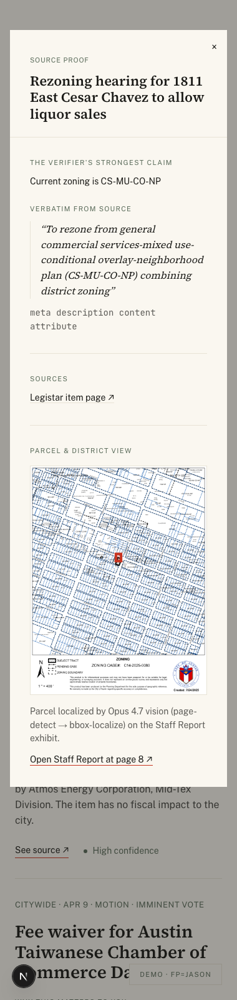
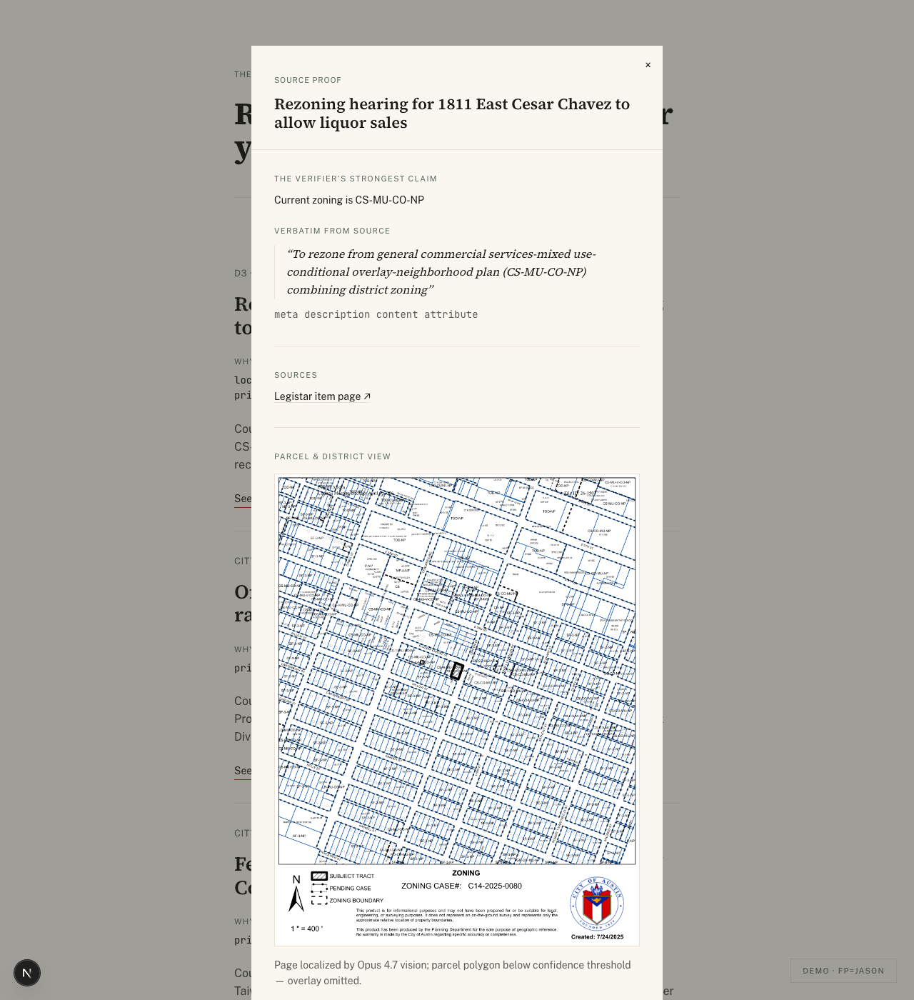
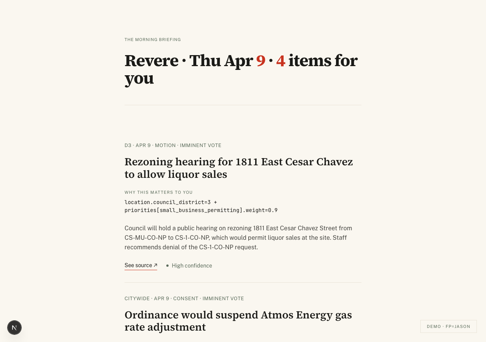
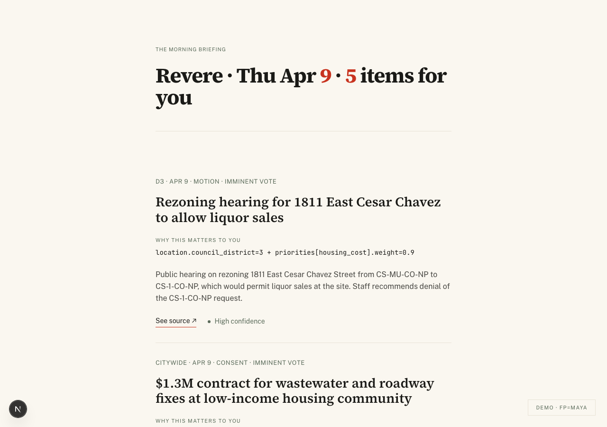

# T-26 Phase B — source-proof modal renders parcel highlight

The `mode="full"` branch of `SourceProofModal` now renders the
pre-extracted Staff Report page with a vermilion-stroke parcel overlay.
Both `/briefing` (auth path) and `/demo?fp=jason|maya` (URL fallback)
fetch the extraction row + signed URL server-side and pass it through
the existing `ItemEnrichment` shape.

## Phase A handoff

11/11 zoning candidates in the 2026-04-09 meeting were extracted at
high confidence in Phase A. See `t-26-smoke.md` for the smoke-test gate
on 26-1501 and the sweep distribution.

## What ships in Phase B

- `apps/web/src/lib/queries/zoning-extraction.ts` — admin-client query
  joined to a 24h-TTL signed URL on the `zoning-maps` Supabase Storage
  bucket.
- `apps/web/src/components/briefing/SourceProofModal.tsx` — the
  `mode="full"` branch now renders an SVG `<image>` of the page with an
  overlaid `<rect>` at the persisted bbox. Vermilion stroke + 25% fill.
  `vector-effect: non-scaling-stroke` keeps the line weight stable
  across viewports.
- `apps/web/src/components/briefing/BriefingView.tsx` — the
  `ItemEnrichment` shape carries an optional `zoningExtraction` and the
  modal call site flips from `mode="minimal"` to `mode="full"`.
- `apps/web/app/briefing/page.tsx` + `apps/web/app/demo/page.tsx` —
  parallel `Promise.all` over briefing items resolves an extraction
  row per candidate via the admin client; `Map<cid, extraction>` joined
  to the Row loop.

The modal has three render paths:

1. **High/medium confidence + bbox**: SVG image + vermilion `<rect>`.
2. **Low confidence OR null bbox + image present**: SVG image without
   the rect; caption "Page localized by Opus 4.7 vision; parcel polygon
   below confidence threshold — overlay omitted."; "Open Staff Report
   at page N ↗" deep-link beneath.
3. **No extraction row OR no image**: nothing extra in the modal beyond
   the existing minimal-mode source-proof. Non-zoning items take this
   path silently.

## Gate evidence

### 1. 1280px — Jason's modal on 26-1501 (the canonical demo state)

Vermilion overlay lands on the SUBJECT TRACT for case C14-2025-0080
(1811 East Cesar Chavez). The parcel highlight is the third (and most
striking) vermilion use on the page, joining the cover-header numerals
and the "See source ↗" underline. No additional vermilion on this view.

### 2. 380px — same modal at mobile

Modal scrolls; SVG scales correctly via `preserveAspectRatio="xMidYMid
meet"`. Stroke weight stays visually consistent thanks to
`vectorEffect="non-scaling-stroke"`.

### 3. Confidence-gated fallback

Forced low-confidence state (temporarily flipped 26-1501 row to
`confidence='low', bbox=null` for capture; restored after). Modal
renders the page image without the rect, prints the caption, and
exposes the page-deep-link. Designed state, not a silent failure.

### 4. Briefing list context (Jason / Maya)

For continuity with Session 6: both personas' briefing lists still load
correctly with the new server-side join in place.

| persona | screenshot |
|---|---|
| Jason |  |
| Maya  |  |

## Architecture notes

- **service-role only**: both the table and the bucket stay
  service-role-only by RLS (no SELECT policy for authenticated). The
  `/briefing` route imports the admin client *just for the extraction
  hop*. This is the same pattern as the existing T-25 modal-data
  resolution (candidate_items + verification_reports).
- **Signed URLs vs public bucket**: the 24h TTL keeps the bucket
  private; URL leakage in client-rendered HTML is non-recoverable but
  bounded.
- **Image element**: SVG `<image href>` is the modern attribute name
  (replaces deprecated `xlink:href`). Renders in all evergreen browsers.
- **Stroke scaling**: `vector-effect: non-scaling-stroke` so the
  vermilion line stays 2px regardless of viewport zoom — otherwise it
  would visually hairline-break at 380px.

## Cost ceiling

Phase B added zero model calls. Total session spend (Phase A + B) is
approximately **$1.40**, well under the $5 ceiling.
