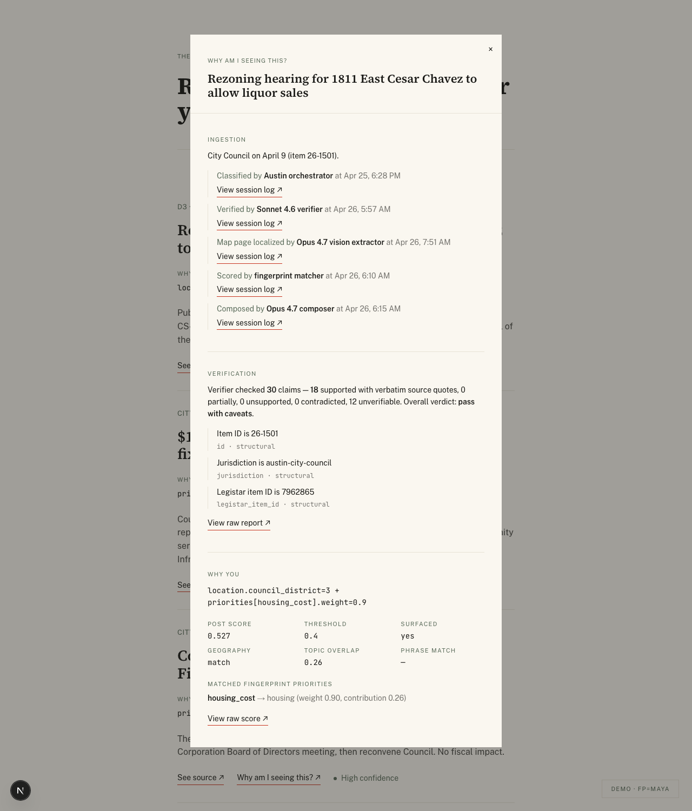
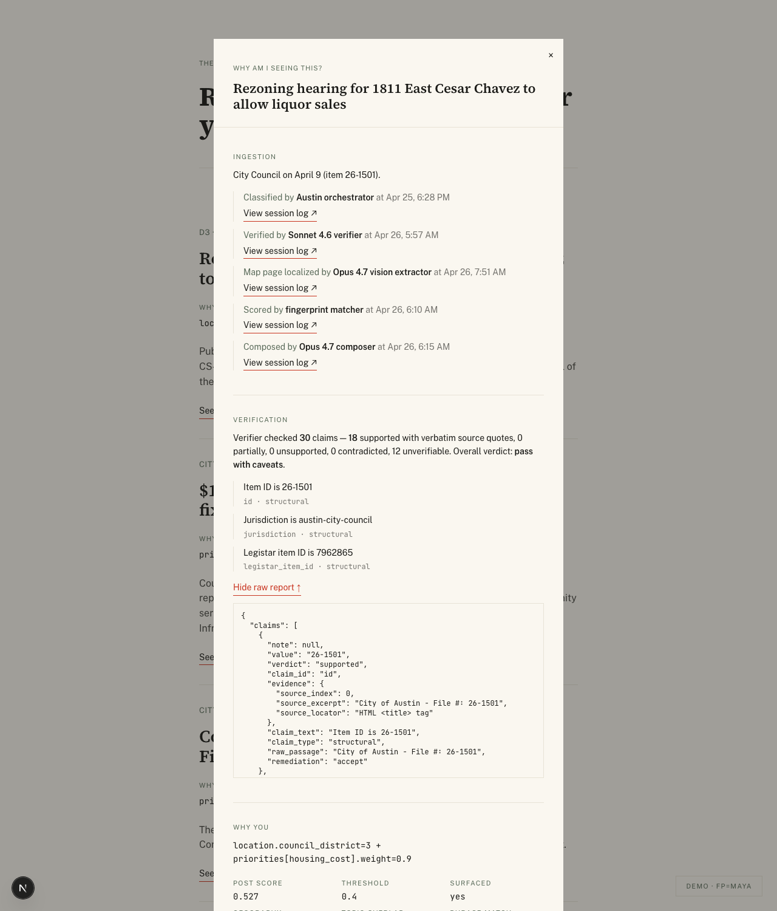
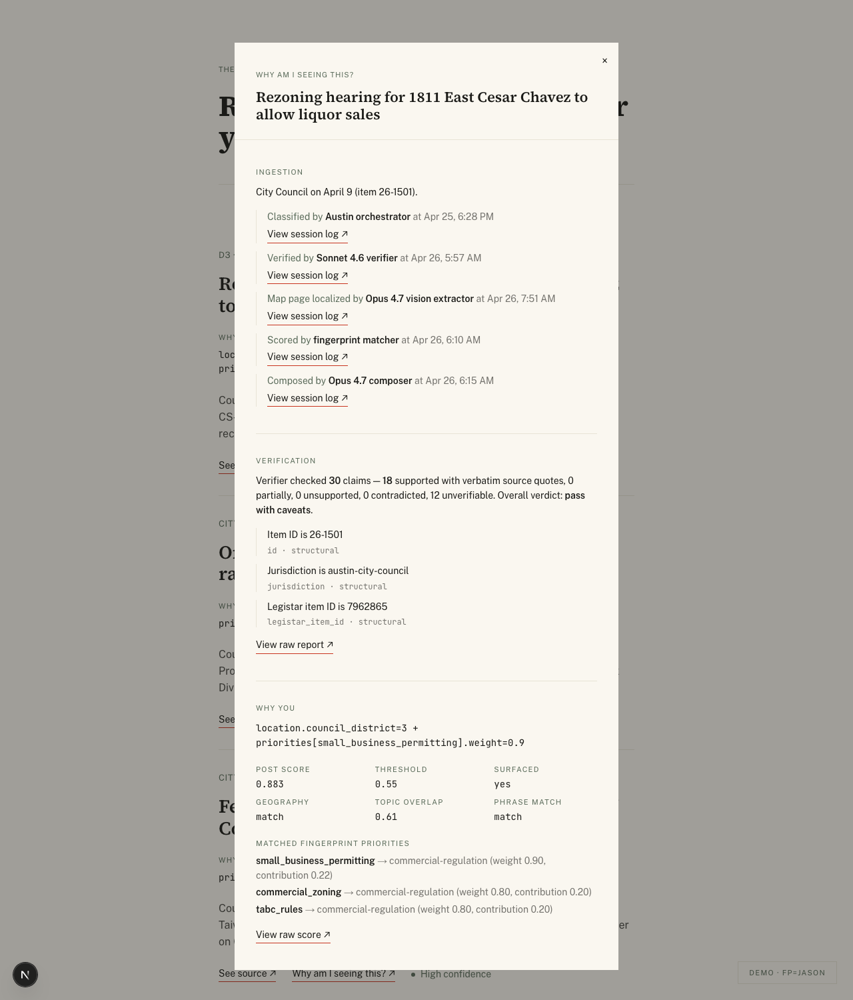
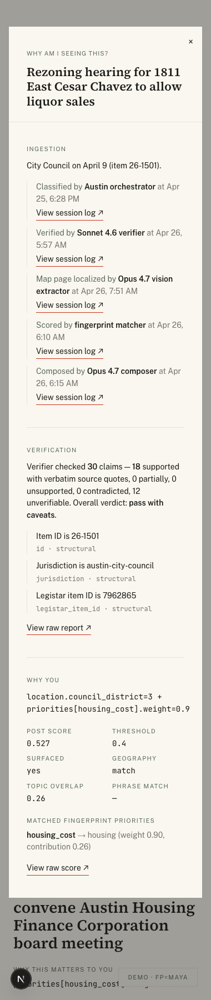

# T-27 — "Why am I seeing this?" trace modal

Three hairline-divided sections (Ingestion · Verification · Why You)
rendered as a second modal-over-briefing-item, sharing the
SourceProofModal idiom. Modal-state on `BriefingView` is now a
single `OpenModal` discriminator (`'source' | 'trace' | null`) so only
one modal can be open at a time — clicking the second button while the
first is open transitions cleanly.

## What ships

- `apps/web/src/lib/queries/trace.ts` — admin-client joined query: the
  briefing_item's `score` JSONB, the meeting metadata, the latest
  verification_report, and all agent_sessions touching the meeting
  plus the per-fingerprint matcher/composer rows (which carry
  `meeting_id=NULL` because they run per-user, not per-meeting).
- `apps/web/src/components/briefing/TraceModal.tsx` — new modal with
  three sections. Each renders humanized prose first; per-section
  "View raw record ↗" inline button reveals JSON beneath in mono font.
  No tabs, no accordion.
- `apps/web/src/components/briefing/BriefingItem.tsx` — adds the
  "Why am I seeing this? ↗" button next to "See source ↗".
- `apps/web/src/components/briefing/BriefingView.tsx` — modal-state
  collapsed to a single `OpenModal` discriminator.
- Both `/briefing` and `/demo?fp=...` server routes pre-fetch traces
  via the existing `Promise.all` enrichment hop; no client round-trip.

## Section design

1. **Ingestion** — humanized prose ("City Council on April 9 (item
   26-1501)"), then a 5-stage timeline: Austin orchestrator → Sonnet
   4.6 verifier → Opus 4.7 vision extractor → fingerprint matcher →
   Opus 4.7 composer. Each stage has a "View session log ↗" toggle
   revealing `agent_sessions.notes` verbatim in mono.
2. **Verification** — rollup ("Verifier checked 30 claims — 18
   supported with verbatim source quotes…"), 3 sample supported
   claims, "View raw report ↗" reveals the full
   `verification_report` JSON (claims array, evidence, source_locator,
   etc.).
3. **Why You** — `score.why_this` rendered verbatim in mono (same
   trust receipt as the inline briefing item), then a 6-cell breakdown
   (post score, threshold, surfaced, geography, topic overlap, phrase
   match), then matched fingerprint priorities. "View raw score ↗"
   reveals the full RelevanceScore JSON.

## Gate evidence

### 1. Maya — default state (1280px)

Five-stage Ingestion timeline, full Verification rollup, Why You
section keyed off Maya's `priorities[housing_cost].weight=0.9`.
Topic overlap 0.26 → housing_cost matched to housing taxonomy.

### 2. Maya — Verification expanded (1280px)

"View raw report ↗" toggled. The full verification_report JSON
expands beneath the prose. 3-sample claims still visible above; raw
report below shows the structural claim_type, source_locator, and
evidence shape.

### 3. Jason — same item, different lens (1280px)

Side-by-side comparison: identical Ingestion + Verification sections,
but Why You now reflects Jason's
`priorities[small_business_permitting].weight=0.9`. Matched
fingerprint priorities show small_business_permitting,
commercial_zoning, and tabc_rules — all mapping to the
commercial-regulation taxonomy.

This is the demo's load-bearing argument: same source, different
people, different reasons.

### 4. Maya — mobile (380px)

Modal scrolls cleanly. Five-stage Ingestion timeline stacks
vertically; the dl breakdown grid drops from 3 to 2 columns;
hairline dividers preserve the section grammar. Vermilion appears
only on the inline "View raw" toggles + the "See source ↗" /
"Why am I seeing this? ↗" item buttons.

## Architectural notes

- **agent_sessions per-fingerprint sessions union**: the matcher and
  composer run per-(user, briefing_date) and emit
  `agent_sessions.meeting_id=NULL`. The trace query unions
  meeting-scoped sessions (orchestrator, verifier, vision-extractor)
  with fingerprint-scoped (matcher, composer) by runtime. This is the
  v1 honest implementation; T-27.5 (structured `tool_calls` +
  `cost_cents` columns + a `candidate_item_id` FK) makes per-item
  filtering exact.
- **JSON view falls back from notes**: when `agent_sessions.notes` is
  null the toggle renders a small JSON snapshot of the row instead.
  Avoids dead toggles on legacy rows.
- **Vermilion ceiling**: section labels stay district sage. Inline
  reveal links + the briefing-item buttons share the vermilion-pb-px
  underline treatment. Parcel highlight (T-26) is the only
  block-fill use of vermilion. Three uses per source-proof modal
  (cover header, see-source link, parcel highlight); two uses on the
  trace modal (see-source link, view-raw link).
- **No client fetch**: all trace data is pre-resolved server-side in
  the same `Promise.all` over briefing items as the zoning extraction.
  4 items × ~3 queries each = 12 round trips per page render, all
  parallel. Acceptable for the demo render path.

## Cost

Zero model calls. ~$0.02 in dev fetches (Sonnet for component
scaffolding, but I built it directly — no LLM-assisted scaffolding
this session).
