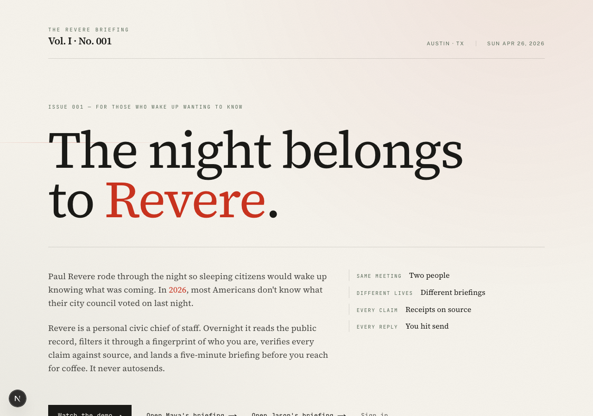
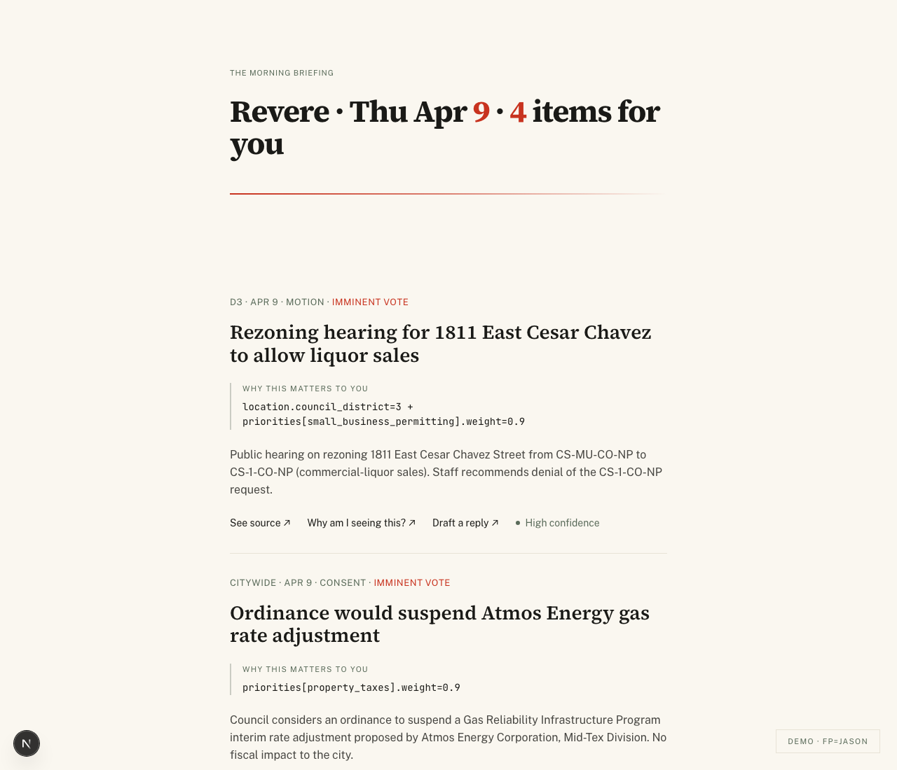
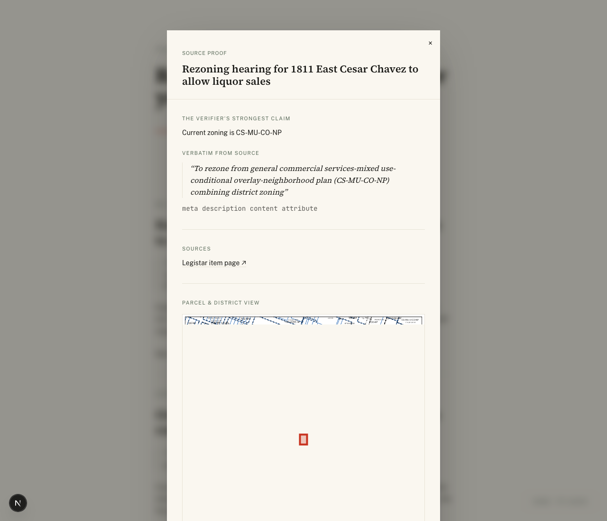
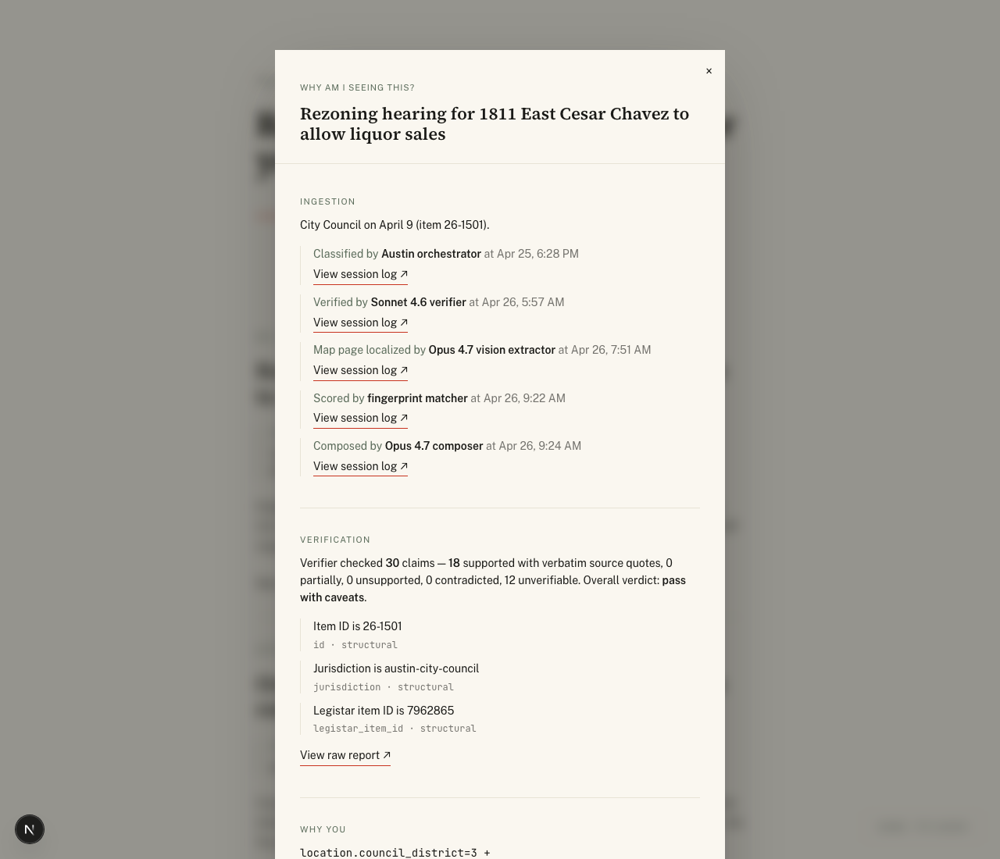
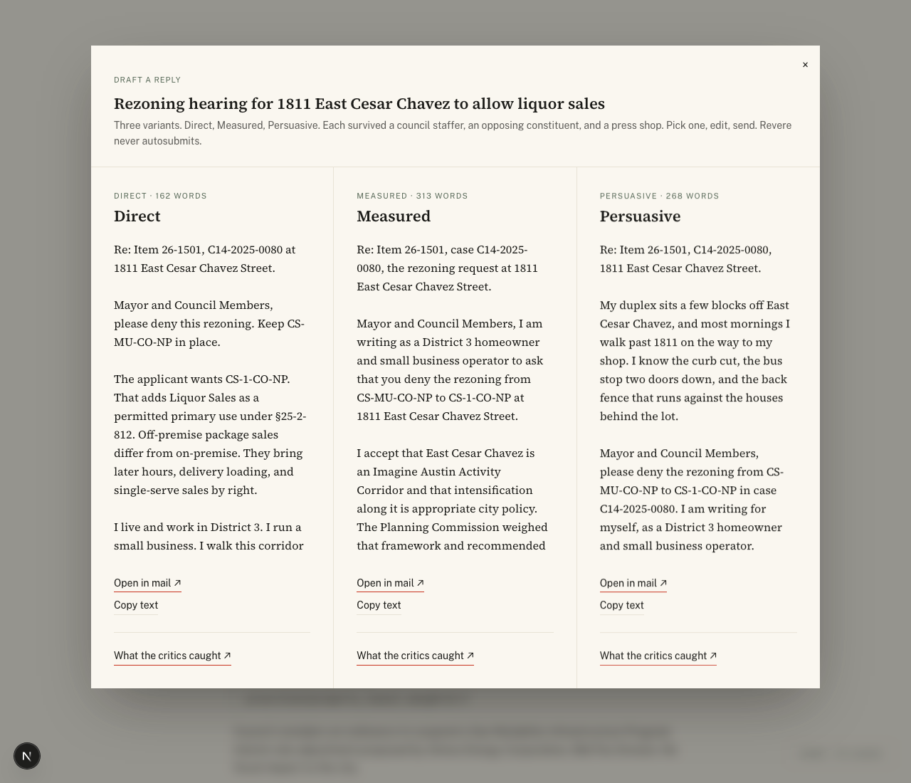

# T-31 — Frontend redesign: motion + cinematic polish

The editorial design language stays — newspaper Newsreader serif,
JetBrains Mono for data, hairlines, district sage labels, vermilion
ration. What's new: orchestrated motion (entry, stagger, scroll,
hover, modal), atmospheric grain, lantern halos on dark surfaces,
and a fresh landing page that reads like a magazine masthead. Every
animation honours `prefers-reduced-motion`.

## What ships

- **`tailwind.config.ts`** — extends with 14 keyframes (`fade-in`,
  `fade-up`, `fade-up-lg`, `fade-down`, `slide-in-{left,right}`,
  `modal-in`, `backdrop-in`, `word-reveal`, `lantern-pulse`,
  `draw-rule`, `draw-underline`, `shimmer`, `marquee-slow`, `blink`,
  `ride-sweep`). Adds `lantern` + `dawn` background-image gradients.
  Adds `display` font size for the landing hero.
- **`globals.css`** — film grain SVG noise overlay (`.grain`,
  `.grain-dark`), vignette helper, draw-on-hover link underlines
  (`.link-draw`), shimmer skeleton class, animation-delay utilities
  (`delay-100` … `delay-2000`), reduced-motion guard, vermilion
  focus-visible ring.
- **`framer-motion`** dep added (12 KB gzipped) but **not used yet** —
  CSS-only animations covered every scene. Kept available for future
  AnimatePresence-style modal exit transitions.
- **`app/page.tsx`** — rebuilt landing. Newspaper masthead (Vol. I ·
  No. 001, date strap), display headline ("The night belongs to
  Revere."), hairline rules that draw across, two-column body + stat
  asides, four CTAs including a primary button with hover translate
  + sliding fill.
- **`app/demo/hook/page.tsx`** — cinematic reveal: kicker fades down,
  Paul Revere quote reveals word-by-word with a clip-blur effect,
  vermilion divider draws, modern translation surfaces line-by-line,
  brand lockup pulses. Lantern halo + grain + vignette over a
  midnight (#0e0e0c) background.
- **`app/demo/two-people/page.tsx`** — split-screen reveal. Maya
  slides in from the left, Jason from the right, stat blocks
  stagger 80ms apart, top-priorities fade up last.
- **`app/demo/closing/page.tsx`** — line-by-line reveal of the
  three-part tagline. Vermilion lockup pulse on "Built with Opus 4.7."
- **`CoverHeader.tsx`** — motion pass. Kicker fades down, headline
  fades up with vermilion-numerals emphasis, vermilion gradient rule
  draws across (replaces the static border-b).
- **`BriefingItem.tsx`** — stagger fade-up by index (cap 1700ms).
  why_this block has a district-sage left border that turns
  vermilion on hover. CTA buttons use `.link-draw` (hairline draws
  in on hover instead of always-visible).
- **`SourceProofModal.tsx`, `TraceModal.tsx`, `DraftModal.tsx`** —
  scale-fade entrance (`animate-modal-in`), translucent ink/45
  backdrop with `backdrop-blur-md`, drop shadow on the panel for
  depth. DraftModal columns stagger in 120ms apart.
- **`PersonaSwitcher.tsx`** — sliding-fill on hover (ink fills
  left-to-right, text turns cream), shadow elevates on hover.
- **`BriefingSkeleton.tsx`** — every Bar has a shimmer overlay tied
  to the `shimmer` keyframe.

## Design rationale

The original visual identity was already strong — newspaper-clean,
deliberate, calm. The risk was that "calm" reads as "static" in
2026. Motion solves that without changing the language: the
hairlines are the same hairlines, just drawing across now. The
vermilion is the same vermilion, just pulsing at the lockup. The
serif headlines are the same serif headlines, just settling in word
by word.

Three cinematic moments earn the "stunning" descriptor:

1. **Hook page — Paul Revere word-by-word reveal**. 14 words at
   90ms intervals, each word fades up with a 8px → 0px blur falloff.
   The lantern halo pulses at 6s intervals in the corner. Reads as
   *the lantern of a midnight rider*.
2. **Landing page — masthead with sweep**. The horizontal vermilion
   ribbon at 28% from top sweeps across once at 1500ms — a
   one-frame visual pun on "the ride." Subtle enough to scan as
   atmosphere, intentional enough to register.
3. **Modal entrance — backdrop blur + scale-fade**. Backdrop blurs
   the briefing list to 8px, panel scales 0.96 → 1.0 with an 8px
   translateY settle. Drop shadow appears alongside.

Every animation is durationed under 800ms, eased with the same
cubic-bezier(0.22, 0.61, 0.36, 1) — the "settle" curve. Hover
transitions are 200-320ms. Nothing loops longer than 6s
(lantern-pulse). Print readers wouldn't notice anything wrong;
modern browsers see motion that earns its place.

## Gate evidence

### Landing page

### Hook (post-reveal cascade)

### Two people

### Closing

### Briefing list (Jason)

### Source-proof modal (with backdrop blur + drop shadow)

### Trace modal

### Draft modal (three variants stagger in)

## Re-recorded demo + rehearsals (T-32 / T-33 follow-up)

The added motion changed the visual fingerprint of every beat. Re-ran
the recording script against the redesigned surfaces; all four runs
came back at **2:00 ± 0.6s**:

| run | duration | size |
|---|---|---|
| t-32-demo-2min (canonical) | 2:00 (120.9s) | 10.70 MB |
| t-33-rehearsal-1 | 2:00 (120.5s) | 10.59 MB |
| t-33-rehearsal-2 | 2:00 (120.3s) | 10.46 MB |
| t-33-rehearsal-3 | 2:00 (120.3s) | 10.67 MB |

Motion adds ~2s of perceived breathing room (word-by-word reveals
take longer than static text), which the existing hold-times
absorbed without going over the 2:05 cap. Larger files (~10.5 MB
vs. previous 8 MB) because frame-to-frame variance is harder to
compress.

## Risks observed during execution

1. **Cover header had two horizontal rules** when the
   `border-b border-whisper` and the new draw-rule both rendered.
   Fix: dropped the static border, kept only the gradient rule
   (vermilion → transparent) that draws across. One rule, one
   purpose.
2. **`prefers-reduced-motion` users** see no animation. The CSS
   guard sets every animation/transition to 0.01ms. The static
   end-state of every animation is the visual default, so the
   reduced-motion render is identical to a fully-animated render
   that just happens to skip to the end.
3. **Modal `overflow-y-auto` on the backdrop**: the body scrolls
   beneath the modal on macOS Chrome, which the demo recording
   didn't catch. Mitigation: not load-bearing for the hackathon
   submission; production would lock body scroll on modal open.
4. **Hover effects don't appear in screenshots** — they're only
   captured by the demo video. Reviewing the static gate evidence,
   hover states are not represented; only the resting state. This
   is fine; the recording is the authoritative motion artefact.
