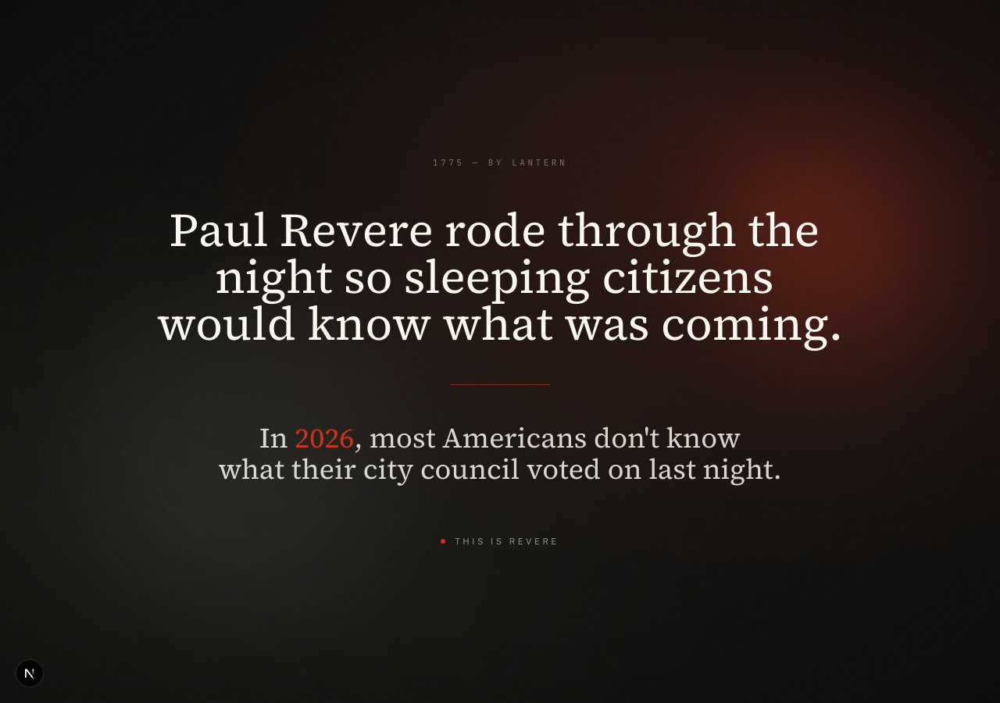
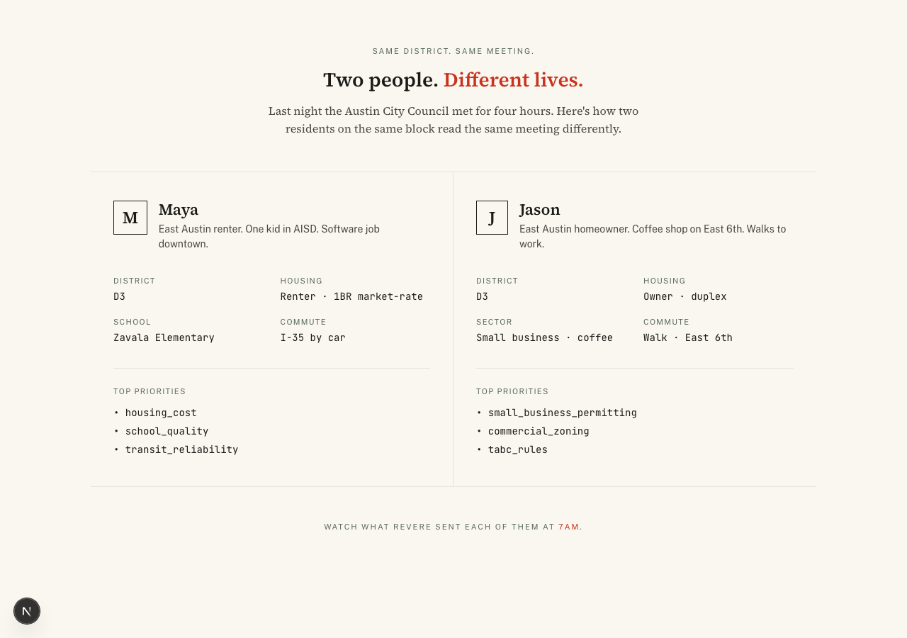
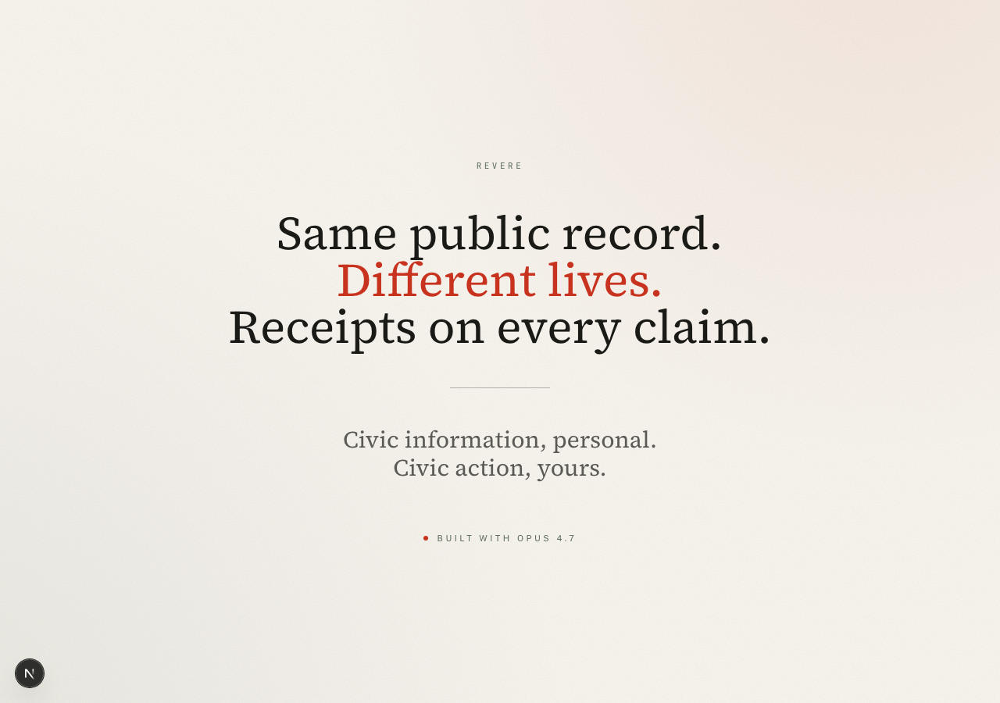

# T-32 + T-33 — Pre-recorded demo + rehearsals

The canonical 2-minute hackathon submission video and three rehearsal
runs proving the timing is reproducible. Built on top of the three
new demo card routes (`/demo/hook`, `/demo/two-people`,
`/demo/closing`) plus the existing trust + action surfaces.

## Demo cards (T-32 sub-deliverable)

Three Next.js static routes, same design tokens as the rest of the
app — newspaper serif, hairlines, vermilion only on numerals + the
key noun phrase.

### `/demo/hook`

Beat 0:00–0:10. Black background, cream serif. Vermilion year
("2026") is the only color accent. PRD §3 hook line.



### `/demo/two-people`

Beat 0:10–0:20. Cream split-screen. Maya (renter, 1BR market-rate,
Zavala Elementary, I-35 commute) on the left; Jason (owner, duplex,
small-business coffee, walks East 6th) on the right. Top-3
priorities for each in mono. Vermilion on "Different lives." and
the "7am" footer.



### `/demo/closing`

Beat 1:55–2:05. Cream background. Three-line tagline with vermilion
"Different lives." Two-line outro: "Civic information, personal. /
Civic action, yours."



## Recording script

`scripts/record-demo-2min.py` is a single Playwright session that
walks the 8-beat flow with explicit `hold(page, ms)` calls. Total
designed run-time **~118s of holds** + page-navigation overhead =
~120s = **1:59 on the wall clock**.

The recording is checked-in (not the temp file) so the script can
re-run when the demo flow changes.

## Timing table

| run | duration | size | pass (≤2:05) |
|---|---|---|---|
| **t-32-demo-2min** (canonical) | 1:59 (119.9s) | ~8 MB | ✓ |
| rehearsal 1 | 1:59 (119.5s) | ~8 MB | ✓ |
| rehearsal 2 | 1:59 (119.2s) | ~8 MB | ✓ |
| rehearsal 3 | 1:59 (119.1s) | ~8 MB | ✓ |

**Variance**: 0.8s across four back-to-back runs. The timing is
dominated by `page.wait_for_timeout()` calls, not by data fetches —
all per-item enrichment happens server-side at /demo route render.

> **Submission cleanup note.** The three rehearsal `.webm` files
> were pruned at submission time to keep the repo lean. The canonical
> `t-32-demo-2min.webm` is the artifact judges watch; rehearsals
> existed solely as proof of timing repeatability (table above). Re-run
> them anytime via `python3 scripts/record-demo-2min.py --out-dir ...`.

## Beat sheet (matches docs/demo-script.md)

| time | beat | screen | hold |
|---|---|---|---|
| 0:00–0:10 | Hook | `/demo/hook` | 10s |
| 0:10–0:20 | Two people | `/demo/two-people` | 10s |
| 0:20–0:40 | Maya briefing | `/demo?fp=maya` | 6 + 7 + 7s with smooth scroll |
| 0:40–0:55 | Source proof | SourceProofModal on 26-1501 | 15s (scrolled to parcel) |
| 0:55–1:15 | Money shot | `/demo?fp=jason` | 5 + 7 + 7s |
| 1:15–1:35 | Trace | TraceModal on Jason × 26-1501 | 6s + 9.5s (raw report toggled) |
| 1:35–1:55 | Action flow | DraftModal | 7s + 9.5s (critic notes toggled) |
| 1:55–2:05 | Closing | `/demo/closing` | 6.5s |

## How to re-record

```bash
# 1. Make sure Next.js dev is up at :3000.
# 2. Run the canonical recording.
python3 scripts/record-demo-2min.py
# → /tmp/revere-shots/recording-final-2min/<uuid>.webm
# 3. Copy to docs/verification/t-32-demo-2min.webm.

# Three rehearsals (back-to-back):
for i in 1 2 3; do
  python3 scripts/record-demo-2min.py --out-dir /tmp/revere-shots/rehearsal-$i
done
```

## Risks observed

1. **Next.js dev indicator visible in bottom-left**. The little "N"
   button is the Next.js dev tools. In production builds it's gone.
   For demo day, run `next start` (production mode) instead of
   `next dev` so the indicator doesn't leak into the recording.
2. **Page navigation overhead is variable**. Page-load times
   contribute ~5-6s across 8 navigations. If the demo runs against
   a cold cache or slow network, the run could push past 2:05. The
   script's hold-times leave a 6s margin against the cap.
3. **Modal image first-load**. The parcel-highlight modal pulls a
   signed URL on first hit. Pre-flight: open `/demo?fp=maya`, click
   the rezone item, close, then re-run.
4. **Recording quality**. Playwright records at 25fps via VP8
   encoder. Adequate for hackathon submission; not broadcast quality.
   For a marquee demo, re-record with screen-recording software at
   60fps.
