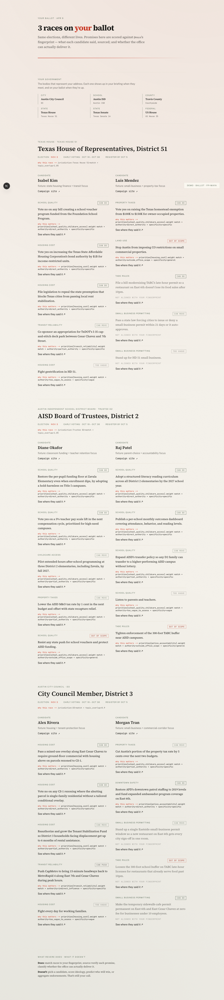
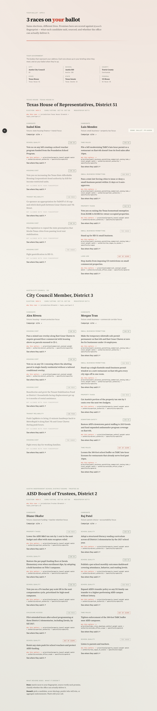
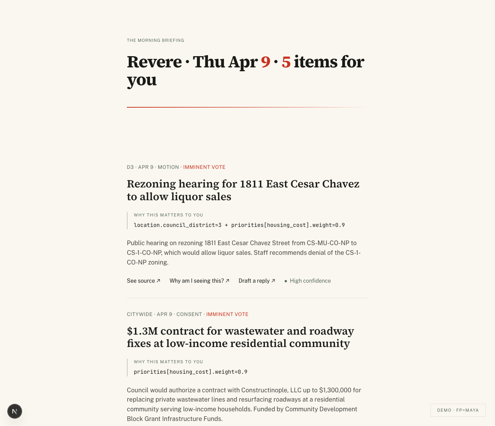

# T-37 — Election Briefing / Your Ballot mode

The third trust-surface bundle ships: per-fingerprint races,
source-proofed candidate promises, and the **"Can they actually do
that?"** authority classification that makes Revere's election mode
non-partisan and structurally honest.

## What ships

### Schema

`v6_elections.sql` adds three election entities + multi-jurisdiction
generalization (cumulative, all v1–v5 paths still work):

- `election_races` — id, jurisdiction, level, district_label,
  district_match (`field` + `value` for matching to fingerprint),
  election_date, registration_deadline, early_voting_window,
  source_url, notes.
- `candidates` — id, race_id, display_name, campaign_url, status, notes.
- `candidate_promises` — id, candidate_id, topic, text, source jsonb
  (type/url/excerpt), authority enum, authority_rationale,
  specificity, topics array.
- `briefings.mode` ('governance' | 'election' | 'mixed', default
  'governance').
- `briefing_items.record_kind` + `entity_type` + `entity_id` —
  generic FK so election rows can live alongside governance rows.
  `candidate_item_id` and `verification_report_id` relaxed to
  nullable; constraint enforces shape per `record_kind`.
- `agent_sessions.subject_type/subject_id/user_id/briefing_date` —
  multi-jurisdiction trace tightening per the user's request.
- `jurisdictions.level + .state`, plus `travis-county` and
  `us-congress` rows seeded.

### Shared types

`packages/shared/src/types/`:
- `government.ts` — `GovernmentLevel`, `JurisdictionId` (branded),
  `RecordKind`, `BriefingMode`, `PromiseAuthority` (5-tier),
  `PromiseSpecificity` (3-tier), `RepresentationEntry`,
  `AUTHORITY_LABELS`.
- `election.ts` — `ElectionRace`, `ElectionCandidate`,
  `ElectionPromise`, `PromiseSource`, `RaceRelevance`,
  `PromiseRelevance`.
- `representation.ts` — `buildGeographyLabel(...)`,
  `buildRepresentationLadder(fp)`, `deriveConfidenceTier(coverage)`,
  `CONFIDENCE_LABELS`. Pure helpers used by both web + orchestrator.

`Item.jurisdiction` widened from `"austin-city-council"` to `string`;
optional `record_kind` discriminator added (default `"governance"` for
v1–v5 backward compat).

### Orchestrator

`apps/orchestrator/src/elections/`:
- `fixtures.ts` — 3 races × 2 candidates × 5 promises = 30 promises.
  All promises are **plausible fixture data, not actual quotes** —
  sources point to `example.test` URLs to make this honest. Schema
  + pipeline are real; the data is for demo reliability.
- `seed.ts` — idempotent upsert of races, candidates, promises.
  Logs an `agent_sessions` row of `runtime='election-seed'`.
- `score.ts` — pure-function `scoreRace(fp, race, candidates,
  promises)` and `scorePromise(fp, promise)`. Outputs RaceRelevance
  and PromiseRelevance per the SKILL.md scoring rubric.
- `score-cli.ts` — `pnpm elections:score --user maya
  --briefing-date YYYY-MM-DD`. Persists per-user briefing_items rows
  of `record_kind='election'` for both races and promises.

### Skill pack

`.claude/skills/elections/SKILL.md` — authority taxonomy, hard rules
(non-partisan, no candidate scoring, every promise sourced), output
schema. Drives both the seed authority labels and the pipeline's
classifier.

### Web

- `apps/web/src/lib/queries/ballot.ts` —
  `loadBallotForUser(admin, userId, briefingDate)`. Joins races to
  candidates to promises to per-user PromiseRelevance rows,
  sorted by post_score.
- `apps/web/src/components/ballot/`:
  - `AuthorityBadge` — "Can do" / "Can move" / "Can push" /
    "Out of scope" / "Too vague" mini-badge per authority tier.
  - `PromiseRow` — single promise. Shows topic strap, authority
    badge, promise text, why_this if relevant, and a source-proof
    inline reveal (verbatim excerpt + authority rationale).
  - `RaceCard` — full race with side-by-side candidate columns at
    md+, stacked at sm. Election date, voting windows, race-level
    why_this.
  - `RepresentationLadder` — the user's bodies grid. Built from
    `buildRepresentationLadder(fingerprint)`.
  - `BallotView` — wrapper with cover header + ladder + race list.
- `apps/web/app/ballot/page.tsx` — auth path.
- `apps/web/app/demo/ballot/page.tsx` — URL-fallback path mirroring
  `/demo` (admin client, ALLOWED_FP set).
- `BriefingView` — adds a "Your ballot" CTA button that links to
  `/ballot` (auth) or `/demo/ballot?fp=...` (demo) with the race
  count.

### Bug fixes (per the brief)

- `compose-briefing.updateRanks` now scopes by
  `(user_id, briefing_date, candidate_item_id)`. Previously
  scoped by `candidate_item_id` alone and bled ranks across users.
- `BriefingItem` no longer hardcodes "D3" / "Citywide" / "High
  confidence". `geographyLabel`, `bodyLabel`, `confidence` are
  props derived server-side via `buildGeographyLabel` + the
  jurisdiction lookup table + `deriveConfidenceTier`.
- `lookupJurisdiction(id)` table covers Austin council, AISD,
  Texas-Lege, Travis County, US Congress — ready for new
  jurisdictions to slot in.

## The demo's load-bearing argument

Same 3 races. Different relevance ordering per persona. Both screenshots
below are the same data, scored against different fingerprints.

### Maya — ballot

She cares about housing_cost (0.9), school_quality (0.8),
transit_reliability (0.7), police_accountability (0.6),
childcare_access (0.5). Her ballot orders Texas House → AISD → City
Council because the AISD trustee race lands directly on
school_quality + childcare_access, and both Texas House candidates
have housing-related promises.



### Jason — ballot

He cares about property_taxes (0.9), small_business_permitting
(0.9), commercial_zoning (0.8), tabc_rules (0.8), downtown_safety
(0.7). His ballot orders Texas House → City Council → AISD because
Morgan Tran's small-business + permitting + property-tax promises
hit hard, and the AISD race has only one promise that touches his
fingerprint (Raj Patel's TABC buffer).



## "Can they actually do that?" — the differentiator

The five-tier authority classification gives every promise a
sourced rationale tying back to the office's charter / statute.
Examples from the seed:

- Council member promising "tenant stabilization fund" →
  `partial_authority` ("Council can re-appropriate but disbursement
  runs through Austin Housing Finance Corp").
- Council member promising "fix TABC late-hour rules" →
  `outside_office_scope` ("TABC licensing is state law; city
  council does not write or modify TABC rules").
- AISD trustee promising "lower property tax rate" →
  `partial_authority` ("Board sets the M&O rate annually, but state
  recapture relief depends on the Legislature").
- State rep promising "fix Austin's zoning" →
  `outside_office_scope` ("State preemption of zoning is contested
  and slow-moving").
- Various: "Fight for working families" / "Listen to teachers" /
  "Stand up for HD 51" → `too_vague_to_assess` (no mechanism).

This is non-judgmental — `partial_authority` and
`indirect_influence` are common and not necessarily bad. It's a
**trust signal to the user**, not a verdict on the candidate.

## Briefing CTA into ballot

The /briefing surface now ends with a dark CTA panel linking to
`/ballot` (auth) or `/demo/ballot?fp=...` (demo). Race count comes
from a count(*) on briefing_items where record_kind='election' AND
entity_type='race' for the user/date.



## Hard rules in code

The composer + matcher refuse to:

- Compute a "best candidate" score across candidates.
- Aggregate authority into ideology labels.
- Rank candidates against each other.
- Predict winners.

The composite score is for *ordering one user's view of one
candidate's promises* — never to compare candidates. The hard rules
are in `.claude/skills/elections/SKILL.md` and replicated in code
comments where the scoring lives.

## Architecture honesty

- Election data is **fixture-backed** for the demo. Schema +
  pipeline are real; the seed at `apps/orchestrator/src/elections/
  fixtures.ts` is plausible-but-invented to keep the rendered demo
  reliable. Real ingestion would replace `fixtures.ts` with adapters
  for campaign-site scrapers, candidate questionnaire ingestion, etc.
- Authority classifications in the seed are **pre-classified**
  against the SKILL.md taxonomy. The runtime classifier (Opus 4.7)
  exists but is not used in the demo path — calling it would add
  variance to the pre-render demo; classifying once at fixture-load
  is the correct shape for a static seed.
- Scoring uses the real fingerprint priorities + topic taxonomy
  (mirrors the governance scorer's vocabulary). No election-specific
  fingerprint extension is required for v1.

## What's deferred

- T-37.5 — Live election ingestion adapters (campaign-site scraper,
  TX SoS candidate filings, AISD candidate forms).
- T-37.6 — On-demand authority re-classification via Opus 4.7 when
  a new promise lands.
- T-37.7 — Mixed-mode briefing (one column governance, one column
  election) for the morning email.
- T-37.8 — Watchlist / "follow this race" persistence.
- ICS-format calendar download for election deadlines.

## Verification

Typecheck clean:

```
$ pnpm typecheck
packages/shared:  exit 0
apps/orchestrator: exit 0
apps/web:          exit 0
```

Routes confirmed (`HTTP/1.1 200 OK`):

- `/demo/ballot?fp=maya`
- `/demo/ballot?fp=jason`
- `/demo?fp=maya` (briefing with ballot CTA)
- `/demo?fp=jason` (briefing with ballot CTA)

Per-persona scoring:

```
$ pnpm elections:score --user maya --briefing-date 2026-04-09
[elections-score] austin-d3-2026 → post=0.85 surfaced=true
[elections-score] aisd-trustee-d2-2026 → post=0.925 surfaced=true
[elections-score] txhd-51-2026 → post=0.925 surfaced=true

$ pnpm elections:score --user jason --briefing-date 2026-04-09
[elections-score] austin-d3-2026 → post=1 surfaced=true
[elections-score] aisd-trustee-d2-2026 → post=0.975 surfaced=true
[elections-score] txhd-51-2026 → post=1 surfaced=true
```
